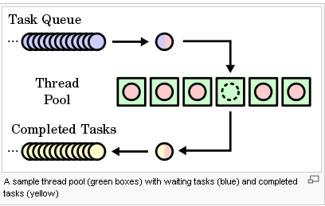
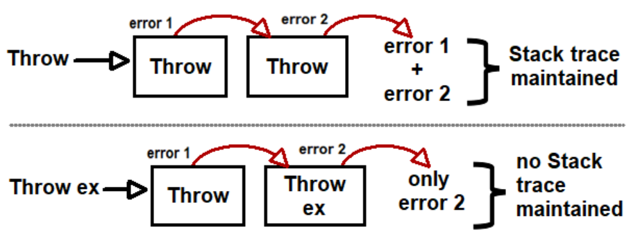

## C#

## 1. C# Interface vs Abstract Class Comparison Table

| The Basis of comparison|C# Interface|C# Abstract Class|
|------------------------|------------|-----------------|
| Access Specifier              | In C#, Interface cannot have an access specifier for functions. It is public by default. | In C#, an abstract class can have access to a specifier for functions. |
| Implementation                | In C#, an interface can only have a signature, not the implementation.                   | An abstract class can provide a complete implementation.               |
| Speed                         | The interface is comparatively slow.                                                     | An abstract class is fast.                                             |
| Instantiate                   | The interface is absolutely abstract and cannot be instantiated.                         | An abstract class cannot be instantiated.                              |
| Fields                        | The interface cannot have fields.                                                        | An abstract class can have defined fields and constants.               |
| Methods                       | The interface has only abstract methods.                                                 | An abstract class can have non-abstract methods.                       |

**Conclusion**

* In C#, an Abstract class vs interface C# has been used for data abstraction. An interface is better than an abstract class when multiple classes need to implement the interface. The member of the interface cannot be static. The only complete member of an abstract class can be static.

* C# does not support multiple inheritances; interfaces are mainly used to implement the multiple inheritances. As a class can implement more than one interface and only inherit from one abstract class. An interface is mainly used only when we do not require the implementation of methods or functionalities. An abstract class is used when we do require at least a default implementation.

* These both C# Interface vs Abstract Class are great object-oriented programming concepts that are used highly in developing applications as per the requirement. It is purely selected by the technical leads with which they are more comfortable and the business requirement. Both are easy to use and simple to learn in any programming language.

## 2. Delegates

* What if we want to pass a function as a parameter? How does C# handles the callback functions or event handler? The answer is - delegate.

* The delegate is a reference type data type that defines the method signature. You can define variables of delegate, just like other data type, that can refer to any method with the same signature as the delegate.

* There are three steps involved while working with delegates:

1. Declare a delegate
2. Set a target method
3. Invoke a delegate

* A delegate can be declared using the delegate keyword followed by a function signature, as shown below.

``` c#
[access modifier] delegate [return type] [delegate name]([parameters])


public delegate void MyDelegate(string msg); // declare a delegate

// set target method
MyDelegate del = new MyDelegate(MethodA);
// or 
MyDelegate del = MethodA; 
// or set lambda expression 
MyDelegate del = (string msg) =>  Console.WriteLine(msg);

// target method
static void MethodA(string message)
{
    Console.WriteLine(message);
}

del.Invoke("Hello World!");
// or 
del("Hello World!");

```


* Passing Delegate as a Parameter
A method can have a parameter of the delegate type, as shown below.

``` c#
    static void InvokeDelegate(MyDelegate del) // MyDelegate type parameter
    {
        del("Hello World");
    }
```

* Multicast Delegate
The delegate can point to multiple methods. A delegate that points multiple methods is called a multicast delegate. The "+" or "+=" operator adds a function to the invocation list, and the "-" and "-=" operator removes it.

``` c#
public delegate int MyDelegate(); //declaring a delegate

class Program
{
    static void Main(string[] args)
    {
        MyDelegate del1 = ClassA.MethodA;
        MyDelegate del2 = ClassB.MethodB;

        MyDelegate del = del1 + del2; 
        Console.WriteLine(del());// returns 200

        del = del - del2; // removes del2
        del("Hello World");

        del -= del1 // removes del1
        del("Hello World");
    }
}

class ClassA
{
    static int MethodA()
    {
        return 100;
    }
}

class ClassB
{
    static int MethodB()
    {
        return 200;
    }
}

```

**The addition and subtraction operators always work as part of the assignment: del1 += del2; is exactly equivalent to del1 = del1+del2; and likewise for subtraction.**

If a delegate returns a value, then the last assigned target method's value will be return when a multicast delegate called

* Generic Delegate
A generic delegate can be defined the same way as a delegate but using generic type parameters or return type. The generic type must be specified when you set a target method.

For example, consider the following generic delegate that is used for int and string parameters.

``` c#
public delegate T add<T>(T param1, T param2); // generic delegate

class Program
{
    static void Main(string[] args)
    {
        add<int> sum = Sum;
        Console.WriteLine(sum(10, 20));

        add<string> con = Concat;
        Console.WriteLine(conct("Hello ","World!!"));
    }

    public static int Sum(int val1, int val2)
    {
        return val1 + val2;
    }

    public static string Concat(string str1, string str2)
    {
        return str1 + str2;
    }
}
```
* Points to Remember :

1- Delegate is the reference type data type that defines the signature.
2- Delegate type variable can refer to any method with the same signature as the delegate.
3- Syntax: [access modifier] delegate [return type] [delegate name]([parameters])
4- A target method's signature must match with delegate signature.
5- Delegates can be invoke like a normal function or Invoke() method.
6- Multiple methods can be assigned to the delegate using "+" or "+=" operator and removed using "-" or "-=" operator. It is called multicast delegate.
7- If a multicast delegate returns a value then it returns the value from the last assigned target method.
D8- elegate is used to declare an event and anonymous methods in C#.


## 3. asynchronous

C# and .NET Framework (4.5 & Core) supports asynchronous programming using some native functions, classes, and reserved keywords.

**What is Asynchronous Programming?**
In asynchronous programming, the code gets executed in a thread without having to wait for an I/O-bound or long-running task to finish. For example, in the asynchronous programming model, the LongProcess() method will be executed in a separate thread from the thread pool, and the main application thread will continue to execute the next statement.

Microsoft recommends Task-based Asynchronous Pattern  to implement asynchronous programming in the .NET Framework or .NET Core applications using async , await keywords and Task or Task<TResult> class.

Now let's rewrite the above example in asynchronous pattern using async keyword.

``` c#

using System;
using System.Threading.Tasks;

public class Asynchronous1
{
	public static async Task Run()
	{
		LongProcess();
		ShortProcess();
	}

	public static async void LongProcess()
	{
		Console.WriteLine("LongProcess Started");
		await Task.Delay(4000); // hold execution for 4 seconds
		Console.WriteLine("LongProcess Completed");
	}

	static void ShortProcess()
	{
		Console.WriteLine("ShortProcess Started");
		//do something here
		Console.WriteLine("ShortProcess Completed");
	}
}

```
[Code Sample](examples/asynchronous/asynchronous1.cs)

### async, await, and Task
Use async along with await and Task if the async method returns a value back to the calling code. We used only the async keyword in the above program to demonstrate the simple asynchronous void method.

The await keyword waits for the async method until it returns a value. So the main application thread stops there until it receives a return value.

The Task class represents an asynchronous operation and Task<TResult> generic class represents an operation that can return a value. In the above example, we used await Task.Delay(4000) that started async operation that sleeps for 4 seconds and await holds a thread until 4 seconds.

The following demonstrates the async method that returns a value.

``` c#

public class Asynchronous2
{
	public static async Task Run()
	{
        Task<int> result = LongProcess();
        ShortProcess();
        var val = await result; // wait untile get the return value
        Console.WriteLine("Result: {0}", val);
    }

    static async Task<int> LongProcess()
    {
        Console.WriteLine("LongProcess Started");
        await Task.Delay(4000); // hold execution for 4 seconds
        Console.WriteLine("LongProcess Completed");
        return 10;
    }

    static void ShortProcess()
    {
        Console.WriteLine("ShortProcess Started");
        //do something here
        Console.WriteLine("ShortProcess Completed");
    }
}

```
[Code Sample](examples/asynchronous/asynchronous2.cs)

In the above example, in the static async Task<int> LongProcess() method, Task<int> is used to indicate the return value type int. int val = await result; will stop the main thread there until it gets the return value populated in the result. Once get the value in the result variable, it then automatically assigns an integer to val.

An async method should return void, Task, or Task<TResult>, where TResult is the return type of the async method. Returning void is normally used for event handlers. The async keyword allows us to use the await keyword within the method so that we can wait for the asynchronous method to complete for other methods which are dependent on the return value.

If you have multiple async methods that return the values then you can use await for all methods just before you want to use the return value in further steps.

``` c#


public class Asynchronous3
{
	public static async Task Run()
	{
        Task<int> result1 = LongProcess1();
        Task<int> result2 = LongProcess2();
        //do something here
        Console.WriteLine("After two long processes.");
        int val = await result1; // wait untile get the return value
        DisplayResult(val);
        val = await result2; // wait untile get the return value
        DisplayResult(val);
    }

    static async Task<int> LongProcess1()
    {
        Console.WriteLine("LongProcess 1 Started");
        await Task.Delay(4000); // hold execution for 4 seconds
        Console.WriteLine("LongProcess 1 Completed");
        return 10;
    }

    static async Task<int> LongProcess2()
    {
        Console.WriteLine("LongProcess 2 Started");
        await Task.Delay(4000); // hold execution for 4 seconds
        Console.WriteLine("LongProcess 2 Completed");
        return 20;
    }

    static void DisplayResult(int val)
    {
        Console.WriteLine(val);
    }
}

```

[Code Sample](examples/asynchronous/asynchronous3.cs)

In the above program, we do await result1 and await result2 just before we need to pass the return value to another method.

Thus, you can use async, await, and Task to implement asynchronous programming in .NET Framework or .NET Core using C#.

## 4. Attributes (Annotation In Java)

* Attributes are used in C# to convey declarative information or metadata about various code elements such as methods, assemblies, properties, types, etc. Attributes are added to the code by using a declarative tag that is placed using square brackets ([ ]) on top of the required code element. There are two types of Attributes implementations provided by the .NET Framework are:

1- Predefined Attributes
2- Custom Attributes

**Properties of Attributes:**

Attributes can have arguments just like methods, properties, etc. can have arguments.
Attributes can have zero or more parameters.
Different code elements such as methods, assemblies, properties, types, etc. can have one or multiple attributes.
Reflection can be used to obtain the metadata of the program by accessing the attributes at run-time.
Attributes are generally derived from the System.Attribute Class.

1. **Predefined Attributes**
Predefined attributes are those attributes that are a part of the .NET Framework Class Library and are supported by the C# compiler for a specific purpose. Some of the predefined attributes that are derived from the System.Attribute base class are given as follows:

|Attribute|Description|
|---|---|
|AttributeUsage|This attribute specifies the usage of a different attribute.|
|CLSCompliant|This attribute shows if a particular code element complies with the Common Language Specification.|
|ContextStatic|This attribute indicates if a static field value is unique for the specified context.|
|Flags|This attribute indicates if a static field value is unique for the specified context.|
|LoaderOptimization|This attribute sets the optimization policy for the default loader in the main method.|
|NonSerialized|This attribute signifies that the field of the serializable class should not be serialized.|
|Obsolete|This attribute marks the code elements that are obsolete i.e. not in use anymore.|
|Serializable|This attribute signifies that the field of the serializable class can be serialized.|
|ThreadStatic|This attribute indicates that there is a unique static field value for each thread.|
|DllImport|This attribute indicates that the method is a static entry point as shown by the unmanaged DLL.|

### Custom Attributes
* Custom attributes can be created in C# for attaching declarative information to methods, assemblies, properties, types, etc. in any way required. 

1. Define a custom attribute class that is derived from System.Attribute class.
2. The custom attribute class name should have the suffix Attribute.
3. Use the attribute AttributeUsage to specify the usage of the custom attribute class created.
4. Create the constructor and the accessible properties of the custom attribute class.

``` c#
    Attribute.GetCustomAttribute(typeof(ExampleController), typeof(SubControllerActionToViewDataAttribute))

    classType.GetProperties()[i].GetCustomAttributes(true)
```

## Difference between Ref and Out keywords
* The out is a keyword in C# which is used for the passing the arguments to methods as a reference type. It is generally used when a method returns multiple values. The out parameter does not pass the property.

* The ref is a keyword in C# which is used for the passing the arguments by a reference. Or we can say that if any changes made in this argument in the method will reflect in that variable when the control return to the calling method. The ref parameter does not pass the property.
 
 |ref keyword|out keyword|
|:----|:----|
|It is necessary the parameters should initialize before it pass to ref.|It is not necessary to initialize parameters before it pass to out.|
|It is not necessary to initialize the value of a parameter before returning to the calling method.|It is necessary to initialize the value of a parameter before returning to the calling method.|
|The passing of value through ref parameter is useful when the called method also need to change the value of passed parameter.|The declaring of parameter through out parameter is useful when a method return multiple values.|
|When ref keyword is used the data may pass in bi-directional.|When out keyword is used the data only passed in unidirectional.|

## Anonymous types
* Anonymous types in C# are the types which do not have a name or you can say the creation of new types without defining them. It is introduced in C# 3.0. It is a temporary data type which is inferred based on the data that you insert in an object initializer. Or in other words, an anonymous type provides an efficient way to combine a set of read-only into a single object without any explicit type. The type of the anonymous type is automatically generated by the compiler according to the value assigned to its properties. These are best for the “use and throw” types.

Important Points:

* It is derived from System.Object class and it is also a sealed class. So, the properties of anonymous type are read-only means you cannot change their values.
* It can contain one or more read-only properties.
* It does not contain class members such as events, methods, etc.
* The expression that used to initialize properties are not null, anonymous method, or a pointer type.
* You can also create an anonymous type array.
* It cannot be cast to any other type except an object.
* It is of reference type.
* You are not allowed to create a field, property, event, or return type of a method is of anonymous type.
* You are not allowed to declare formal parameters of a method, property, constructor, indexer as a anonymous type.
* The scope of the anonymous type is always limited to the method in which they are defined. Due to their local scope, you are not allowed to pass an anonymous type to another method, but you can pass it to those methods which can accept dynamic type parameters. As shown in the below example.
Note: Generally, passing anonymous type using dynamic type is not recommended.

``` c#
public class GFG {
  
    // Anonymous type object is passed in the 
    // method which has dynamic type parameters
    static public void mymethod(dynamic val)
    {
        Console.WriteLine(val.s_id);
        Console.WriteLine(val.s_name);
        Console.WriteLine(val.language);
    }
  
    // Main method
    static public void Main()
    {
  
        // Anonymous type object
        var anony_object = new {s_id = 134, 
                                s_name = "Siya", 
                             language = "Ruby"};
  
        // Calling mymethod
        mymethod(anony_object);
    }
}
```

### Nested Anonymous Type
* In C#, an anonymous type can have another anonymous type as a property. 

``` c#
 var anony_object = new {s_id = 149,
   s_name = "Soniya",
   language = "C#",
   anony_ob = new { email = "soniya45@gmail.com"}};
```

### Anonymous type in LINQ
* You are allowed to use an anonymous type in LINQ. In LINQ, select clause generates anonymous type so that in a query you can include properties that are not defined in the class

``` c#
List<Geeks> g = new List<Geeks> 
        {
  
            new Geeks{ A_no = 123, Aname = "Shilpa",
                        language = "C#", age = 23 },
            new Geeks{ A_no = 124, Aname = "Shilpi",
                        language = "C#", age = 20 },
            new Geeks{ A_no = 125, Aname = "Soniya", 
                        language = "C#", age = 22 },
            new Geeks{ A_no = 126, Aname = "Sonaly", 
                        language = "C#", age = 25 },
  
        };
  
        // select query showing result
        // using anonymous type
        var anony_ob = from geek in g select new {geek.A_no, geek.Aname, geek.language};
        foreach(var i in anony_ob)
        {
            Console.WriteLine("Author id = " + i.A_no + "\nAuthor name = " 
                                 + i.Aname + "\nLanguage = " + i.language);
            Console.WriteLine();
        }
```
## Dictionary 
* In C#, Dictionary is a generic collection which is generally used to store key/value pairs. The working of Dictionary is quite similar to the non-generic hashtable. The advantage of Dictionary is, it is generic type. 

*Important Points:

1. The Dictionary class implements the
  IDictionary<TKey,TValue> Interface
  IReadOnlyCollection<KeyValuePair<TKey,TValue>> Interface
  IReadOnlyDictionary<TKey,TValue> Interface
  IDictionary Interface
2. In Dictionary, the key cannot be null, but value can be.
3. In Dictionary, key must be unique. Duplicate keys are not allowed if you try to use duplicate key then compiler will throw an exception.
4. In Dictionary, you can only store same types of elements.
5. The capacity of a Dictionary is the number of elements that Dictionary can hold.

## difference between a.Equals(b) and a == b
* The Equals method is just a virtual one defined in System.Object, and overridden by whichever classes choose to do so. The == operator is an operator which can be overloaded by classes, but which usually has identity behaviour.

* For reference types where == has not been overloaded, it compares whether two references refer to the same object - which is exactly what the implementation of Equals does in System.Object.

* Value types do not provide an overload for == by default. However, most of the value types provided by the framework provide their own overload. The default implementation of Equals for a value type is provided by ValueType, and uses reflection to make the comparison, which makes it significantly slower than a type-specific implementation normally would be. This implementation also calls Equals on pairs of references within the two values being compared.

``` c#
string a = new string(new char[] {'h', 'e', 'l', 'l', 'o'});
string b = new string(new char[] {'h', 'e', 'l', 'l', 'o'});

Console.WriteLine (a==b);
Console.WriteLine (a.Equals(b));

// Now let's see what happens with the same tests but
// with variables of type object
object c = a;
object d = b;

Console.WriteLine (c==d);
Console.WriteLine (c.Equals(d));

True
True
False
True
```

## Language Integrated Query (LINQ) (C#)

* Language-Integrated Query (LINQ) is the name for a set of technologies based on the integration of query capabilities directly into the C# language. Traditionally, queries against data are expressed as simple strings without type checking at compile time or IntelliSense support. Furthermore, you have to learn a different query language for each type of data source: SQL databases, XML documents, various Web services, and so on. With LINQ, a query is a first-class language construct, just like classes, methods, events. You write queries against strongly typed collections of objects by using language keywords and familiar operators. The LINQ family of technologies provides a consistent query experience for objects (LINQ to Objects), relational databases (LINQ to SQL), and XML (LINQ to XML).

* For a developer who writes queries, the most visible "language-integrated" part of LINQ is the query expression. Query expressions are written in a declarative **query syntax**.

``` c#
int[] numbers = { 5, 10, 8, 3, 6, 12};

//Query syntax:
IEnumerable<int> numQuery1 =
    from num in numbers
    where num % 2 == 0
    orderby num
    select num;

//Method syntax:
IEnumerable<int> numQuery2 = numbers.Where(num => num % 2 == 0).OrderBy(n => n);

foreach (int i in numQuery1)
{
    Console.Write(i + " ");
}
Console.WriteLine(System.Environment.NewLine);
foreach (int i in numQuery2)
{
    Console.Write(i + " ");
}
```
* In the previous example, notice that the conditional expression (num % 2 == 0) is passed as an in-line argument to the Where method: Where(num => num % 2 == 0). This inline expression is called a **lambda expression**.


## virtual and abstract
* Abstract methods do **not provide an implementation** and they force the derived classes to override the method. It is declared under abstract class. An abstract method only has the method definition

* Virtual methods **have an implementation**, unlike the Abstract method and it can exist in the abstract and non-abstract class. It provides the derived classes with the option of overriding it.

### Virtual Functions
The virtual keyword is useful in modifying a method, property, indexer, or event. When you have a function defined in a class that you want to be implemented in an inherited class(es), you use virtual functions. The virtual functions could be implemented differently in different inherited class and the call to these functions will be decided at runtime.

``` c#
public abstract class E
{
    public abstract void AbstractMethod(int i);

    public virtual void VirtualMethod(int i)
    {
        // Default implementation which can be overridden by subclasses.
    }
}

public class D : E
{
    public override void AbstractMethod(int i)
    {
        // You HAVE to override this method
    }
    public override void VirtualMethod(int i)
    {
        // You are allowed to override this method.
    }
}
```

## Property
Properties combine aspects of both fields and methods. To the user of an object, a property appears to be a field, accessing the property requires the same syntax. To the implementer of a class, a property is one or two code blocks, representing a get accessor and/or a set accessor. The code block for the get accessor is executed when the property is read; the code block for the set accessor is executed when the property is assigned a value. A property without a set accessor is considered read-only. A property without a get accessor is considered write-only. A property that has both accessors is read-write. In C# 9 and later, you can use an init accessor instead of a set accessor to make the property read-only.

``` c#
public class Date
{
    private int _month = 7;  // Backing store

    public int Month
    {
        get => _month;
        set
        {
            if ((value > 0) && (value < 13))
            {
                _month = value;
            }
        }
    }
}
```

### Object initializers
* Object initializers let you assign values to any accessible fields or properties of an object at creation time without having to invoke a constructor followed by lines of assignment statements. The object initializer syntax enables you to specify arguments for a constructor or omit the arguments (and parentheses syntax).
``` c#
public class Cat
{
    // Auto-implemented properties.
    public int Age { get; set; }
    public string Name { get; set; }

    public Cat()
    {
    }

    public Cat(string name)
    {
        this.Name = name;
    }
}

Cat cat = new Cat { Age = 10, Name = "Fluffy" };
Cat sameCat = new Cat("Fluffy"){ Age = 10 };

```
## Thread Pooling

* Thread pooling is the process of creating a collection of threads during the initialization of a multithreaded application, and then reusing those threads for new tasks as and when required, instead of creating new threads. Then every process has some **fixed number of threads depending on the amount of memory available**, those threads are the need of the application but we have freedom to increase the number of threads. Every thread in the pool has a specific given task. **The thread returns to the pool and waits for the next assignment when the given task is completed**.

* The thread can then terminate, or sleep until there are new tasks available.



### Creating thread pooling

The .Net framework library included the "System.Threading.ThreadPool" class. it was so easy to use.You need not create the pool of threads, nor do you have to specify how many consuming threads you require in the pool. The ThreadPool class handles the creation of new threads and the distribution of the wares to consume amongst those threads.

### Why we need thread pooling?

* Thread pooling is essential in multithreaded applications for the following reasons.

* Thread pooling improves the response time of an application as threads are already available in the thread pool waiting for their next assignment and do not need to be created from scratch.

* Thread pooling saves the CLR from the overhead of creating an entirely new thread for every short-lived task and reclaiming its resources once it dies.

* Thread pooling optimizes the thread time slices according to the current process running in the system.

* Thread pooling enables us to start several tasks without having to set the properties for each thread.

* Thread pooling enables us to state information as an object to the procedure arguments of the task that is being executed.

* Thread pooling can be employed to fix the maximum number of threads for processing a particular request.

## inheritance
* Inheritance, together with encapsulation and polymorphism, is one of the three primary characteristics of object-oriented programming. Inheritance enables you to create new classes that reuse, extend, and modify the behavior defined in other classes. The class whose members are inherited is called the base class, and the class that inherits those members is called the derived class. A **derived** class can have only one direct base class. However, inheritance is **transitive**. If ClassC is derived from ClassB, and ClassB is derived from ClassA, ClassC inherits the members declared in ClassB and ClassA.

* Conceptually, a derived class is a **specialization** of the base class. For example, if you have a base class Animal, you might have one derived class that is named Mammal and another derived class that is named Reptile. A Mammal is an Animal, and a Reptile is an Animal, but each derived class represents different specializations of the base class.

## Operator overloading 
Use the operator keyword to declare an operator. An operator declaration must satisfy the following rules:

It includes both a public and a static modifier.
A unary operator has one input parameter. A binary operator has two input parameters. In each case, at least one parameter must have type T or T? where T is the type that contains the operator declaration.

## 

* **Throw** preserves the stack trace. So lets say Source1 throws Error1 , its caught by Source2 and Source2 says throw then Source1 Error + Source2 Error will be available in the stack trace.

* **Throw ex** does not preserve the stack trace. So all errors of Source1 will be wiped out and only Source2 error will sent to the client.



## Events
* An event is a notification sent by an object to signal the occurrence of an action. Events in .NET follow the **observer design pattern**.

* In C#, an event is an **encapsulated delegate**. It is dependent on the delegate. The delegate defines the signature for the event handler method of the subscriber class.

### Design goals for event support
* Enable very minimal coupling between an event source and an event sink. These two components may not be written by the same organization, and may even be updated on totally different schedules.

* It should be very simple to subscribe to an event, and to unsubscribe from that same event.

* Event sources should support multiple event subscribers. It should also support having no event subscribers attached.

## Enum

* An enumeration type (or enum type) is a value type defined by a set of named constants of the underlying **integral numeri**c type. To define an enumeration type, use the enum keyword and specify the names of enum members:

``` c#
enum Season
{
    Spring,
    Summer,
    Autumn,
    Winter
}
enum ErrorCode : ushort
{
    None = 0,
    Unknown = 1,
    ConnectionLost = 100,
    OutlierReading = 200
}

```

* If you want an enumeration type to represent a combination of choices, define enum members for those choices such that an individual choice is a bit field. That is, the associated values of those enum members should be the powers of two. Then, you can use the **bitwise logical operators | or & to combine** choices or intersect combinations of choices, respectively. To indicate that an enumeration type declares bit fields, apply the **Flags** attribute to it. As the following example shows, you can also include some typical combinations in the definition of an enumeration type.

``` c#
[Flags]
public enum Days
{
    None      = 0b_0000_0000,  // 0
    Monday    = 0b_0000_0001,  // 1
    Tuesday   = 0b_0000_0010,  // 2
    Wednesday = 0b_0000_0100,  // 4
    Thursday  = 0b_0000_1000,  // 8
    Friday    = 0b_0001_0000,  // 16
    Saturday  = 0b_0010_0000,  // 32
    Sunday    = 0b_0100_0000,  // 64
    Weekend   = Saturday | Sunday
}

public class FlagsEnumExample
{
    public static void Main()
    {
        Days meetingDays = Days.Monday | Days.Wednesday | Days.Friday;
        Console.WriteLine(meetingDays);
        // Output:
        // Monday, Wednesday, Friday

        Days workingFromHomeDays = Days.Thursday | Days.Friday;
        Console.WriteLine($"Join a meeting by phone on {meetingDays & workingFromHomeDays}");
        // Output:
        // Join a meeting by phone on Friday

        bool isMeetingOnTuesday = (meetingDays & Days.Tuesday) == Days.Tuesday;
        Console.WriteLine($"Is there a meeting on Tuesday: {isMeetingOnTuesday}");
        // Output:
        // Is there a meeting on Tuesday: False

        var a = (Days)37;
        Console.WriteLine(a);
        // Output:
        // Monday, Wednesday, Saturday
    }
}
```
### conversation

``` c#
public enum Season
{
    Spring,
    Summer,
    Autumn,
    Winter
}

public class EnumConversionExample
{
    public static void Main()
    {
        Season a = Season.Autumn;
        Console.WriteLine($"Integral value of {a} is {(int)a}");  // output: Integral value of Autumn is 2

        var b = (Season)1;
        Console.WriteLine(b);  // output: Summer

        var c = (Season)4;
        Console.WriteLine(c);  // output: 4
    }
}
```
