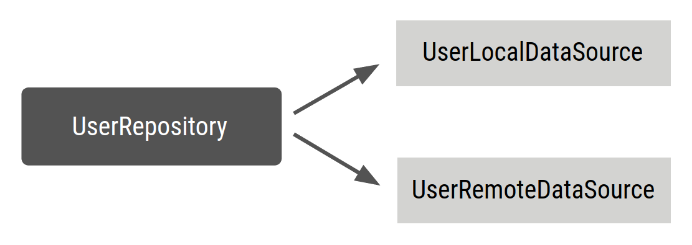

# Dagger
* Manual dependency injection or service locators in an Android app can be problematic depending on the size of your project. You can limit your project's complexity as it scales up by using Dagger to manage dependencies
  
## A simple use case in Dagger: Generating a factory



```kotlin
class UserRepository(
    private val localDataSource: UserLocalDataSource,
    private val remoteDataSource: UserRemoteDataSource
) { ... }
//Add an @Inject annotation to the UserRepository constructor so Dagger knows how to create a UserRepository:

// @Inject lets Dagger know how to create instances of this object
class UserRepository @Inject constructor(
    private val localDataSource: UserLocalDataSource,
    private val remoteDataSource: UserRemoteDataSource
) { ... }

```
## Dagger components
* Dagger can create a graph of the dependencies in your project that it can use to find out where it should get those dependencies when they are needed. To make Dagger do this, you need to create an interface and annotate it with @Component.
* Inside the @Component interface, you can define functions that return instances of the classes you need (i.e. UserRepository). @Component tells Dagger to generate a container with all the dependencies required to satisfy the types it exposes. This is called a Dagger component; it contains a graph that consists of the objects that Dagger knows how to provide and their respective dependencies.
```kotlin
// @Component makes Dagger create a graph of dependencies
@Component
interface ApplicationGraph {
    // The return type  of functions inside the component interface is
    // what can be provided from the container
    fun repository(): UserRepository
}
```
* When you build the project, Dagger generates an implementation of the ApplicationGraph interface for you: DaggerApplicationGraph. With its annotation processor, Dagger creates a dependency graph that consists of the relationships between the three classes (UserRepository, UserLocalDatasource, and UserRemoteDataSource) with only one entry point: getting a UserRepository instance. You can use it as follows:
```kotlin
// Create an instance of the application graph
val applicationGraph: ApplicationGraph = DaggerApplicationGraph.create()
// Grab an instance of UserRepository from the application graph
val userRepository: UserRepository = applicationGraph.repository()
```
**Dagger creates a new instance of UserRepository every time it's requested.**

``` kotlin
val applicationGraph: ApplicationGraph = DaggerApplicationGraph.create()

val userRepository: UserRepository = applicationGraph.repository()
val userRepository2: UserRepository = applicationGraph.repository()

assert(userRepository != userRepository2)
```
* Sometimes, you need to have a unique instance of a dependency in a container. You might want this for several reasons:
1. You want other types that have this type as a dependency to share the same instance, such as multiple ViewModel objects in the login flow using the same LoginUserData.
An object is expensive to create and you don't want to create a new instance every time it's declared as a dependency (for example, a JSON parser).
2. You want other types that have this type as a dependency to share the same instance, such as multiple ViewModel objects in the login flow using the same LoginUserData.
An object is expensive to create and you don't want to create a new instance every time it's declared as a dependency (for example, a JSON parser).
* In the example, you might want to have a unique instance of UserRepository
available in the graph so that every time you ask for a UserRepository, you always get the same instance. This is useful in your example because in a real-life application with a more complex application graph, you might have multiple ViewModel objects depending on UserRepository and you don't want to create new instances of UserLocalDataSource and UserRemoteDataSource
every time UserRepository needs to be provided.

* In manual dependency injection, you do this by passing in the same instance of UserRepository to the constructors of the ViewModel classes; but in Dagger, because you are not writing that code manually, you have to let Dagger know you want to use the same instance. This can be done with scope annotations.

## Scoping with Dagger
* You can use scope annotations to limit the lifetime of an object to the lifetime of its component. This means that the same instance of a dependency is used every time that type needs to be provided.

* **To have a unique instance** of a UserRepository when you ask for the repository in ApplicationGraph, use the same scope annotation for the @Component interface and UserRepository. You can use the **@Singleton** annotation that already comes with the javax.inject package that Dagger uses:

```kotlin
// Scope annotations on a @Component interface informs Dagger that classes annotated
// with this annotation (i.e. @Singleton) are bound to the life of the graph and so
// the same instance of that type is provided every time the type is requested.
@Singleton
@Component
interface ApplicationGraph {
    fun repository(): UserRepository
}

// Scope this class to a component using @Singleton scope (i.e. ApplicationGraph)
@Singleton
class UserRepository @Inject constructor(
    private val localDataSource: UserLocalDataSource,
    private val remoteDataSource: UserRemoteDataSource
) { ... }
```