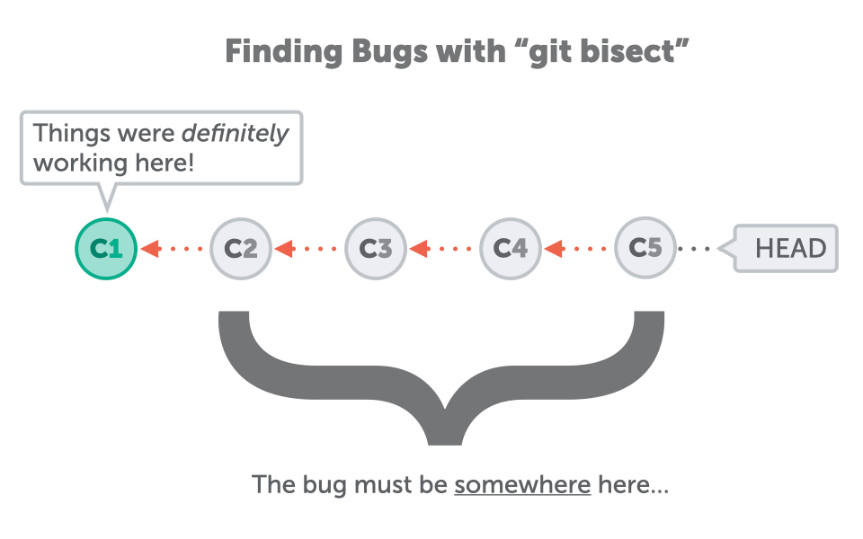
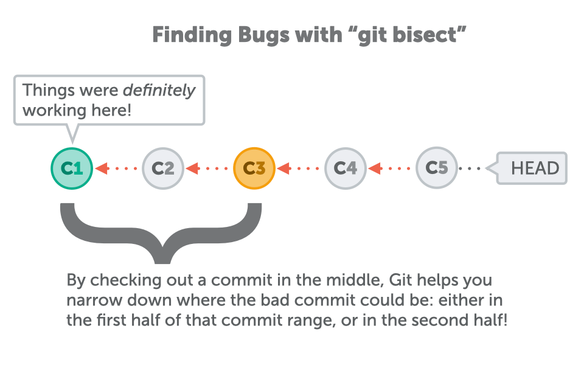
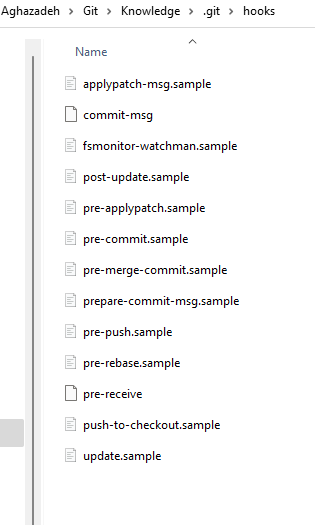
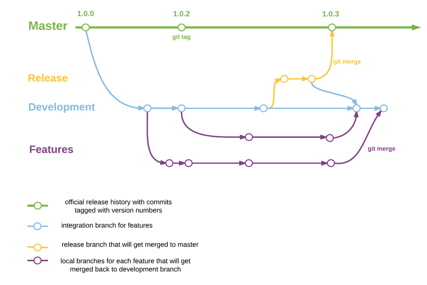

## Git

## 1. How can you check your current git version?
```bash
git --version
```

## 2. What command lets you create a connection between a local and remote repository?

* The git remote command lets you create, view, and delete connections to other repositories. 

```bash
git remote add origin
```
#### More commands
```bash
# List your existing remotes in order to get the name
git remote [-v | --verbose]

git remote add [-t <branch>] [-m <master>] [-f] [--[no-]tags] [--mirror=(fetch|push)] <name> <URL>

git remote rename [--[no-]progress] <old> <new>

git remote remove <name>

git remote set-head <name> (-a | --auto | -d | --delete | <branch>)

git remote set-branches [--add] <name> <branch>…​


git remote get-url [--push] [--all] <name>

git remote set-url [--push] <name> <newurl> [<oldurl>]

git remote set-url --add [--push] <name> <newurl>

git remote set-url --delete [--push] <name> <URL>

git remote [-v | --verbose] show [-n] <name>…​

git remote prune [-n | --dry-run] <name>…​

git remote [-v | --verbose] update [-p | --prune] [(<group> | <remote>)…​]

```
## 3. Git Hard Reset to HEAD

The purpose of the “git reset” command is to move the current HEAD to the commit specified (in this case, the HEAD itself, one commit before HEAD and so on)(**alter the working directory**).


```bash
git reset --hard HEAD       (going back to HEAD)

git reset --hard HEAD^      (going back to the commit before HEAD)

git reset --hard HEAD~1     (equivalent to "^")

git reset --hard HEAD~2     (going back two commits before HEAD)
```

## 4. Git Hard Reset to HEAD
Contrary to the hard reset, the soft reset **won’t alter the working directory** and the index.

As a consequence, the changes done between the original HEAD and the current HEAD will be staged.

```bash
git reset --soft HEAD       (going back to HEAD)

git reset --soft HEAD^      (going back to the commit before HEAD)
git reset --soft HEAD~1     (equivalent to "^")

git reset --soft HEAD~2     (going back two commits before HEAD)
```

## 5. Merge

Merging is Git's way of putting a forked history back together again. The git merge command lets you take the independent lines of development created by git branch and integrate them into a single branch.

```bash
    # Start a new feature
    git checkout -b new-feature main
    # Edit some files
    git add <file>
    git commit -m "Start a feature"
    # Edit some files
    git add <file>
    git commit -m "Finish a feature"
    # Merge in the new-feature branch
    git checkout main
    git merge new-feature
    git branch -d new-feature
```


#### **Squash** 

Instead of each commit on the topic branch being added to the history of the default branch, a **squash** merge adds all the file changes to **a single new commit** on the default branch.

A simple way to think about this is that squash merge gives you just the file changes, and a regular merge gives you the file changes and the commit history.


## 6. Add
```bash
# Stage a specific directory or file
git add <path> 

 # Stage all files (that are not listed in the .gitignore) in the entire repository
git add .

# Interactively stage hunks of changes
git add -p 

 # stages all files, including new, modified, and deleted files, including files in the current directory and in higher directories that still belong to the same git repository
git add -A / --all

#stages modified and deleted files only, NOT new files
git add -u 


```

## 7. cherry-pick
* Cherry picking is the act of picking a commit from a branch and applying it to another.

**Team collaboration**

Often times a team will find individual members working in or around the same code. Maybe a new product feature has a backend and frontend component. There may be some shared code between to two product sectors. Maybe the backend developer creates a data structure that the frontend will also need to utilize. The frontend developer could use git cherry-pick to pick the commit in which this hypothetical data structure was created. This pick would enable the frontend developer to continue progress on their side of the project.

**Bug hotfixes**

When a bug is discovered it is important to deliver a fix to end users as quickly as possible. For an example scenario,say a developer has started work on a new feature. During that new feature development they identify a pre-existing bug. The developer creates an explicit commit patching this bug. This new patch commit can be cherry-picked directly to the main branch to fix the bug before it effects more users.

**Undoing changes and restoring lost commits**

Sometimes a feature branch may go stale and not get merged into main. Sometimes a pull request might get closed without merging. Git never loses those commits and through commands like git log and git reflog they can be found and cherry picked back to life.


## 8. Git Commands - Patching

**In Git, there are two main ways to integrate changes from one branch into another: the merge and the rebase.**

A few commands in Git are centered around the concept of thinking of commits in terms of the changes they introduce, as though the commit series is a series of patches. These commands help you manage your branches in this manner.

**git cherry-pick**

The git cherry-pick command is used to take the change introduced in a single Git commit and try to re-introduce it as a new commit on the branch you’re currently on. This can be useful to only take one or two commits from a branch individually rather than merging in the branch which takes all the changes.

Cherry picking is described and demonstrated in Rebasing and Cherry-Picking Workflows.

**git rebase**

The git rebase command is basically an automated cherry-pick. It determines a series of commits and then cherry-picks them one by one in the same order somewhere else.

Rebasing is covered in detail in Rebasing, including covering the collaborative issues involved with rebasing branches that are already public.

We use it in practice during an example of splitting your history into two separate repositories in Replace, using the --onto flag as well.

We go through running into a merge conflict during rebasing in Rerere.

We also use it in an interactive scripting mode with the -i option in Changing Multiple Commit Messages.

**git revert**

The git revert command is essentially a reverse git cherry-pick. It creates a new commit that applies the exact opposite of the change introduced in the commit you’re targeting, essentially undoing or reverting it.

## 9. Using git bisect to Quickly Find Bugs

Once you provide these two commit hashes, Git understands the bug must be somewhere between the "bad" and "good" commits. The way git bisect operates is fairly simple, but also quite effective: it splits the range of commits between "good" and "bad" in half - and checks out a commit in the middle.

```bash
    git bisect start
    git bisect bad HEAD
    git bisect good fcd61994
    Bisecting: 3 revisions left to test after this (roughly 1 step)
    [0023cdddf42d916bd7e3d0a279c1f36bfc8a051b] Changing page structure
    git bisect reset
```





## 10. rebase
* Rebase is one of two Git utilities that specializes in integrating changes from one branch onto another. The other change integration utility is git merge. Merge is always a forward moving change record. Alternatively, rebase has powerful history rewriting features. 

* Rebasing is the process of moving or combining a sequence of commits to a new base commit. Rebasing is most useful and easily visualized in the context of a feature branching workflow.


* The primary reason for rebasing is to maintain a linear project history. For example, consider a situation where the main branch has progressed since you started working on a feature branch. You want to get the latest updates to the main branch in your feature branch, but you want to keep your branch's history clean so it appears as if you've been working off the latest main branch.

**Don't rebase public history**

 * You can run rebase interactively by adding the -i option to git rebase. You must indicate how far back you want to rewrite commits by telling the command which commit to rebase onto.

```bash
git rebase -i HEAD~3
```
Remember again that this is a rebasing command — every commit in the range HEAD~3..HEAD with a changed message and all of its descendants will be rewritten. Don’t include any commit you’ve already pushed to a central server — doing so will confuse other developers by providing an alternate version of the same change.
```bash
#  means during playback the commit will be discarded from the final combined commit block.
git rebase -- d

# leaves the commit as is. It will not modify the commit's message or content and will still be an individual commit in the branches history.
git rebase -- p 

# during playback executes a command line shell script on each marked commit. A useful example would be to run your codebase's test suite on specific commits, which may help identify regressions during a rebase.
git rebase -- x 
```

## 11. Git Hooks

* Git hooks are scripts that run automatically every time a particular event occurs in a Git repository. They let you customize Git’s internal behavior and trigger customizable actions at key points in the development life cycle.
  
* Common use cases for Git hooks include encouraging a commit policy, altering the project environment depending on the state of the repository, and implementing continuous integration workflows.

* To enable hooks, remove file extension



### local hooks:

* pre-commit
* prepare-commit-msg
* commit-msg
* post-commit
* post-checkout
* pre-rebase

## 12. Git Environment

```bash
git config --global user.name "Ahmad.Aghazadeh"  

git config -list  

git config --global core.pager "cat"

git config --global pager.diff "less -FX"

```

### Git configuration levels

* --local

It is the default level in Git. Git config will write to a local level if no configuration option is given. Local configuration values are stored in .git/config directory as a file.

* --global

The global level configuration is **user-specific** configuration. User-specific means, it is applied to an individual operating system user. Global configuration values are stored in a user's home directory. ~ /.gitconfig on UNIX systems and C:\Users\\.gitconfig on windows as a file format.

* --system

The system-level configuration is applied across an entire system. The entire system means **all users on an operating system and all repositories**. The system-level configuration file stores in a gitconfig file off the system directory. $(prefix)/etc/gitconfig on UNIX systems and C:\ProgramData\Git\config on Windows.

## 13. How could you squash multiple commits together without using git merge --squash?
* Rebasing

## 14. clone 
* git clone is a Git command line utility which is used to target an existing repository and create a clone, or copy of the target repository
```bash
#Cloning a specific tag
git clone --branch <tag> <repo>

#In this example a clone of ＜repo＞ is made and only the most recent commit is included in the new cloned Repo
git clone -depth=1 <repo>
```

## 15. diff-tree

How can you display a list of files added or modified in a specific commit?

Use the diff-tree command with the commit hash.

## 16. gitignore


| Pattern                          | Example matches                                                                     | Explanation*                                                                                                                                                                                                         |
|----------------------------------|-------------------------------------------------------------------------------------|----------------------------------------------------------------------------------------------------------------------------------------------------------------------------------------------------------------------|
|  **/logs                         |  logs/debug.log logs/monday/foo.bar build/logs/debug.log                            |  You can prepend a pattern with a double asterisk to match directories anywhere in the repository.                                                                                                                   |
|  **/logs/debug.log               |  logs/debug.log build/logs/debug.log but not logs/build/debug.log                   |  You can also use a double asterisk to match files based on their name and the name of their parent directory.                                                                                                       |
|  *.log                           |  debug.log foo.log .log logs/debug.log                                              |  An asterisk is a wildcard that matches zero or more characters.                                                                                                                                                     |
|  *.log !important.log            |  debug.log trace.log but not important.log logs/important.log                       |  Prepending an exclamation mark to a pattern negates it. If a file matches a pattern, but also matches a negating pattern defined later in the file, it will not be ignored.                                         |
|  *.log !important/*.log trace.*  |  debug.log important/trace.log but not important/debug.log                          |  Patterns defined after a negating pattern will re-ignore any previously negated files.                                                                                                                              |
|  /debug.log                      |  debug.log but not logs/debug.log                                                   |  Prepending a slash matches files only in the repository root.                                                                                                                                                       |
|  debug.log                       |  debug.log logs/debug.log                                                           |  By default, patterns match files in any directory                                                                                                                                                                   |
|  debug?.log                      |  debug0.log debugg.log but not debug10.log                                          |  A question mark matches exactly one character.                                                                                                                                                                      |
|  debug[0-9].log                  |  debug0.log debug1.log but not debug10.log                                          |  Square brackets can also be used to match a single character from a specified range.                                                                                                                                |
|  debug[01].log                   |  debug0.log debug1.log but not  debug2.log debug01.log                              |  Square brackets match a single character form the specified set.                                                                                                                                                    |
|  debug[!01].log                  |  debug2.log but not debug0.log debug1.log debug01.log                               |  An exclamation mark can be used to match any character except one from the specified set.                                                                                                                           |
|  debug[a-z].log                  |  debuga.log debugb.log but not debug1.log                                           |  Ranges can be numeric or alphabetic.                                                                                                                                                                                |
|  logs                            |  logs logs/debug.log logs/latest/foo.bar build/logs build/logs/debug.log            |  If you don't append a slash, the pattern will match both files and the contents of directories with that name. In the example matches on the left, both directories and files named logs are ignored                |
|  logs/                           |  logs/debug.log logs/latest/foo.bar build/logs/foo.bar build/logs/latest/debug.log  |  Appending a slash indicates the pattern is a directory. The entire contents of any directory in the repository matching that name – including all of its files and subdirectories – will be ignored                 |
|  logs/ !logs/important.log       |  logs/debug.log logs/important.log                                                  |  Wait a minute! Shouldn't logs/important.log be negated in the example on the left Nope! Due to a performance-related quirk in Git, you can not negate a file that is ignored due to a pattern matching a directory  |
|  logs/**/debug.log               |  logs/debug.log logs/monday/debug.log logs/monday/pm/debug.log                      |  A double asterisk matches zero or more directories.                                                                                                                                                                 |
|  logs/*day/debug.log             |  logs/monday/debug.log logs/tuesday/debug.log but not logs/latest/debug.log         |  Wildcards can be used in directory names as well.                                                                                                                                                                   |
|  logs/debug.log                  |  logs/debug.log but not debug.log build/logs/debug.log                              |  Patterns specifying a file in a particular directory are relative to the repository root. (You can prepend a slash if you like, but it doesn't do anything special.)                                                |

## 18. commit

* -m <message>
Sets the commit's message. Make sure to provide a concise description that helps your teammates (and yourself) understand what happened.

* -a
Includes all currently changed files in this commit. Keep in mind, however, that **untracked (new)** files are not included.

* --amend
Rewrites the very last commit with any currently staged changes and/or a new commit message. Git will rewrite the last commit and effectively replace it with the amended one. Note that such a rewriting of commits should only be performed on commits that have not been pushed to a remote repository, yet.

```bash

git commit -m "Change titles and styling on homepage"

# If you have lots of changed files in your working copy - and want all of them included in the next commit - you can make use of the "-a" parameter and thereby omit the "git add" step:
git commit -a -m "Change titles and styling on homepage"

# The "--amend" option comes in handy, for example, when you mistyped the last commit's message or forgot to add a change. The following example will correct the very last commit by overwriting its message and adding another change:
git commit --amend -m "New commit message"

```

## 19. overview


## 20. tag 



 Tags are ref's that point to specific points in Git history. Tagging is generally used to capture a point in history that is used for a marked version release (i.e. v1.0.1). A tag is like a branch that doesn’t change.
```bash
git tag <tagname>
```

### Annotated Tags
Annotated tags are stored as full objects in the Git database. To reiterate, They store extra meta data such as: the tagger name, email, and date. Similar to commits and commit messages Annotated tags have a tagging message. Additionally, for security, annotated tags can be signed and verified with GNU Privacy Guard (GPG). Suggested best practices for git tagging is to prefer annotated tags over lightweight so you can have all the associated meta-data.

```bash
git tag -a v1.4
git tag -a v1.4 -m "my version 1.4"

```

### Lightweight Tags

```bash
git tag v1.4-lw
```

Executing this command creates a lightweight tag identified as v1.4-lw. Lightweight tags are created with the absence of the -a, -s, or -m options. Lightweight tags create a new tag checksum and store it in the .git/ directory of the project's repo.

* You can view the state of a repo at a tag by using the git checkout command.
  
```bash
git checkout v1.4
```

* Listing Tags
```bash
git tag

# list of tags
git tag -l      
```

## 21. Fixing GIT Branch and Tag Name Collisions
```bash
git show tag1
git show branchName

# if in a project you have tag and branch the same, you would use below commands

git show refs/tags/release1
git show refs/heads/release1

https://geedew.com/fixing-git-branch-and-tag-name-collision/

```
## 22. push

```bash
# To push branch to remote repository. For defualt git doest allow your send old change to remote repositoty.
git push <remote> <branch>

# To send old change to remote repository
git push <remote> --force

# To send all branch changes
git push <remote> --all

# To send tags to remote. For default git doest push tags to remote repository
git push <remote> --tags

# Bare repos don’t have a working directory so a push will not alter any in progress working directory content.
git init --bare <directory>

```
## 23. alias

* Aliases are used to create shorter commands that map to longer commands.
  
```bash
git config --global alias.co checkout
git config --global alias.br branch
git config --global alias.ci commit
git config --global alias.st status
```

* Creating the aliases will not modify the source commands. So git checkout will still be available even though we now have the git co alias. 

* Directly editing Git config files The global or local config files can be manually edited and saved to create aliases. The global config file lives at **$HOME/.gitconfig** file path. The local path lives within an active git repository at **/.git/config**

## 24. log
```bash
# Show log in a single line
git log --oneline

# The --stat option displays the number of insertions and deletions to each file altered by each commit (note that modifying a line is represented as 1 insertion and 1 deletion).
git log --stat


# This outputs the entire patch representing that commit. Include more info.
git log -p

git shortlog

git log --graph --oneline --decorate

# filtering
git log -3
git log --after="2014-7-1"
git log --after="yesterday"
git log --after="2014-7-1" --before="2014-7-4"
git log --author="John"
git log --author="John\|Mary"
git log --grep="JRA-224:"
git log -- foo.py bar.py
git log -S"Hello, World!"
git log main..feature
git log --no-merges
git log --merges

```

## 25. rm

* The primary function of git rm is to remove tracked files from the Git index. Additionally, git rm can be used to remove files from both the staging index and the working directory.
* There is no option to remove a file from only the working directory. The files being operated on must be identical to the files in the current HEAD. If there is a discrepancy between the HEAD version of a file and the staging index or working tree version, Git will block the removal. This block is a safety mechanism to prevent removal of in-progress changes.

```bash
# The "dry run" option is a safeguard that will execute the git rm command but not actually delete the files. Instead it will output which files it would have removed.
git rm -n/--dry-run test.js

# The -r option is shorthand for 'recursive'. When operating in recursive mode git rm will remove a target directory and all the contents of that directory.

git rm -r directory

# The cached option specifies that the removal should happen **only on the staging index**. Working directory **files will be left alone**.

git rm --cached file.js

# This causes the command to exit with a 0 sigterm status even if no files matched. This is a Unix level status code. The code 0 indicates a successful invocation of the command. The --ignore-unmatch option can be helpful when using git rm as part of a greater shell script that needs to fail gracefully.

git r, --ignore-unmatch file.js

```

## 26. To keeping a git structure after successfully merge two branchs.

Run git branch -d <branch name> to delete the merged branch.

## 27. stash 

* git stash temporarily shelves (or stashes) changes you've made to your working copy so you can work on something else, and then come back and re-apply them later on.

* The git stash command takes your uncommitted changes (both staged and unstaged), saves them away for later use, and then reverts them from your working copy. 

```bash
# save changes on stash
git stash 

# Popping your stash removes the changes from your stash and reapplies them to your working copy.
git stash pop

#you can reapply the changes to your working copy and keep them in your stash with git stash apply:
git stash apply
```
**This is useful if you want to apply the same stashed changes to multiple branches.**

### Stashing untracked or ignored files
By default, running git stash will stash:

* changes that have been added to your index (staged changes)
* changes made to files that are currently tracked by Git (unstaged changes)

But it will not stash:

* new files in your working copy that have not yet been staged
* files that have been ignored

Adding the -u option (or --include-untracked) tells git stash to also stash your untracked files:

```bash
git stash -u
```

You can include changes to ignored files as well by passing the -a option (or --all) when running git stash.

```bash
git stash -a
```


## 28. init

* The git init command creates a new Git repository. It can be used to convert an existing, unversioned project to a Git repository or initialize a new, empty repository. Most other Git commands are not available outside of an initialized repository, so this is usually the first command you'll run in a new project.

```bash

git init

# Create an empty Git repository in the specified directory.
git init <directory>

```

* If you've already run git init on a project directory and it contains a .git subdirectory, you can safely run git init again on the same project directory. It will not override an existing .git configuration.
  
* The most common use case for  git init --bare is to create a remote central repository:

```bash
git init <directory> --template=<template_directory>
```
*  The default Git templates usually reside in a `/usr/share/git-core/templates` directory but may be a different path on your machine.

* The default templates are a good reference and example of how to utilize template features. A powerful feature of templates that's exhibited in the default templates is **Git Hook configuration**.

## 29. rerere
  
* You need to set the configuration variable rerere.enabled in order to enable this command. While working on a feature branch you try to use "git rerere" to solve a recurring merge conflict but nothing is happening. 

* This command assists the developer in this process by recording conflicted automerge results and corresponding hand resolve results on the initial manual merge, and applying previously recorded hand resolutions to their corresponding automerge results.

## 30. type of git objects

If you have read Curious git, you know that git stores different types of objects in .git/objects. The object types are:

* commit; 
* tree;
* blob;
* annotated tag.

### commit
* The commit object contains the directory tree object hash, parent commit hash, author, committer, date and message.

```bash
git log
commit eebf02006948079f1935e19f582700f8e0acb1b5
Author: Matthew Brett <matthew.brett@gmail.com>
Date:   Fri Feb 4 11:26:27 2022 +0000

    An example commit
```


## 30. Distributed Git - Distributed Workflows

* Centralized Workflow


* Integration-Manager Workflow


* Dictator and Lieutenants Workflow

All the lieutenants have one integration manager known as the **benevolent dictator**. The benevolent dictator pushes from their directory to a reference repository from which all the collaborators need to pull.


 
## 31. Git Internals - Transfer Protocols

* Git can transfer data between two repositories in two major ways: the **“dumb”** protocol and the **“smart”** protocol. This section will quickly cover how these two main protocols operate.

### The Dumb Protocol

 If you’re setting up a repository to be served read-only over HTTP, the dumb protocol is likely what will be used. This protocol is called “dumb” because it requires no Git-specific code on the server side during the transport process; the fetch process is a series of HTTP GET requests, where the client can assume the layout of the Git repository on the server.

 ### The Smart Protocol
 * SSH
 * HTTP(S)


## 32. What's
* Having a distributed architecture, Git is an example of a DVCS (**hence Distributed Version Control System**). Rather than have only one single place for the full version history of the software as is common in once-popular version control systems like CVS or Subversion (also known as SVN), in Git, every developer's working copy of the code is also a repository that can contain the full history of all changes.

### Snapshots, Not Differences

* The major difference between Git and any other VCS (Subversion and friends included) is the way Git thinks about its data. Conceptually, most other systems store information as a list of **file-based changes**. These other systems (CVS, Subversion, Perforce, Bazaar, and so on) think of the information they store as **a set of files and the changes made to each file over time** (this is commonly described as delta-based version control).


* Git doesn’t think of or store its data this way. Instead, **Git thinks of its data more like a series of snapshots of a miniature filesystem**. With Git, every time you commit, or save the state of your project, Git basically takes **a picture of what all your files** look like at that moment and stores a reference to that snapshot. To be efficient, **if files have not changed, Git doesn’t store the file again**, just a link to the previous identical file it has already stored. Git thinks about its data more like a stream of snapshots.


 
