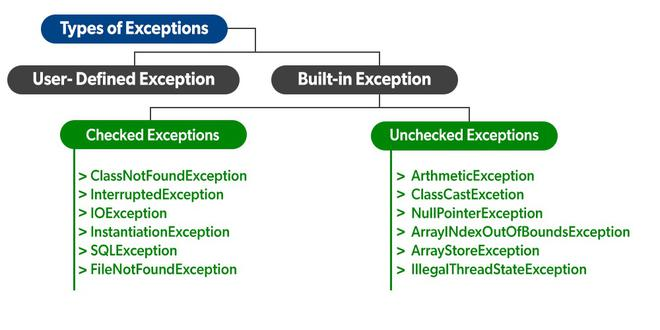

# Java

## 1. Runtime Polymorphism in Java

* Polymorphism is a technique wherein a single action can be performed in two different ways.

* Polymorphism in Java can be done in two ways, method **overloading** and method **overriding**. There are two types of polymorphism in Java.
  
  1. Compile-time polymorphism
    Compile-time polymorphism is a process in which a call to an **overridden** method is resolved at compile time. 

  2. Runtime polymorphism.
    Runtime polymorphism, also known as the **Dynamic Method Dispatch**, is a process that resolves a call to an **overridden method at runtime**. The process involves the use of the reference variable of a superclass to call for an overridden method.
* Upcasting
If the reference variable of Parent class refers to the object of Child class, it is known as upcasting.
``` java
class Bike{  
  void run(){System.out.println("running");}  
}  
class Splendor extends Bike{  
  void run(){System.out.println("running safely with 60km");}  
  
  public static void main(String args[]){  
    Bike b = new Splendor();//upcasting  
    b.run();  
  }  
}  
```

## 2. Exception
* In Java, an exception is an event that disrupts the normal flow of the program. It is an object which is thrown at runtime.


There are mainly two types of exceptions: checked and unchecked. An error is considered as the unchecked exception. However, according to Oracle, there are three types of exceptions namely:

 1. Checked Exception
  The classes that directly inherit the Throwable **class except RuntimeException** and Error are known as checked exceptions. For example, IOException, SQLException, etc. Checked exceptions are checked **at compile-time**.

 2. Unchecked Exception
   The classes that inherit the RuntimeException are known as unchecked exceptions. For example, ArithmeticException, NullPointerException, ArrayIndexOutOfBoundsException, etc. Unchecked exceptions are not **checked at compile-time, but they are checked at runtime.**
 
 3. Error
  Error is irrecoverable. Some example of errors are OutOfMemoryError, VirtualMachineError, AssertionError etc.



|Keyword|Description|
|:----|:----|
|try|The "try" keyword is used to specify a block where we should place an exception code. It means we can't use try block alone. The try block must be followed by either catch or finally.|
|catch|The "catch" block is used to handle the exception. It must be preceded by try block which means we can't use catch block alone. It can be followed by finally block later.|
|finally|The "finally" block is used to execute the necessary code of the program. It is executed whether an exception is handled or not.|
|throw|The "throw" keyword is used to throw an exception.|
|throws|The "throws" keyword is used to declare exceptions. It specifies that there may occur an exception in the method. It doesn't throw an exception. It is always used with method signature.|

 [Code Sample](examples/ExceptionSample.java)

 ``` java

 public class ExceptionSample {
    public static void main(String[] args) {
        System.out.println(print(1));
        System.out.println(print1(1)); <== has an error because print1 has throws in signature
    }

    static Exception print(int i){
        if (i>0) {
            return new Exception();
        } else {
            throw new RuntimeException();
        }
    }

    static  void print1(int i) throws Exception {
        if (i>0) {
            throw new Exception();
        } else {
            throw new RuntimeException();
        }
    }
}

 ```   

 ## 3. interface
 * An **interface in Java** is a blueprint of a class. It has static constants and abstract methods.

* In other words, you can say that interfaces can have abstract methods and **variables**. It cannot have a method body.

* It cannot be **instantiated** just like the abstract class.

* Since Java 8, we can have **default and static methods** in an interface.

* Since Java 9, we can have **private methods** in an interface.

* Why use Java interface?
  1. It is used to achieve abstraction.
  2. By interface, we can support the functionality of **multiple inheritance**.
  3. It can be used to achieve **loose coupling**.


[Code Sample](examples/InterfaceSample.java)

 ``` java

public class InterfaceSample {
     
    interface One {
        default void method() {
            System.out.println("One");
        }
    }
    
    interface Two {
        default void method () {
            System.out.println("One");
        }
    }
    class Three implements One, Two {

        public void method() {
            One.super.method();
            Two.super.method();
        }
    }
}
 ``` 

## 4. instanceof

* The java instanceof operator is used to test whether the object is an instance of the specified type (class or subclass or interface).

* The instanceof in java is also known as type comparison operator because it compares the instance with type. It returns either **true or false**. If we apply the instanceof operator with any variable that has null value, it returns false.

* If we apply instanceof operator with a variable that have null value, it returns **false**. Let's see the example given below where we apply instanceof operator with the variable that have null value.

``` java
  Dog2 d=null;  
  System.out.println(d instanceof Dog2);//false  
```
* Possibility of downcasting with instanceof
Let's see the example, where downcasting is possible by instanceof operator.

``` java
class Dog3 extends Animal {  
  static void method(Animal a) {  
    if(a instanceof Dog3){  
       Dog3 d=(Dog3)a;//downcasting  
       System.out.println("ok downcasting performed");  
    }  
  }  
```

* Downcasting without the use of java instanceof

``` java
class Animal { }  
class Dog4 extends Animal {  
  static void method(Animal a) {  
       Dog4 d=(Dog4)a;//downcasting  
       System.out.println("ok downcasting performed");  
  }  
   public static void main (String [] args) {  
    Animal a=new Dog4();  
    Dog4.method(a);  
  }  
}  

```

## 5. access modifiers 


## 6. final
* final keyword is used in different contexts. First of all, final is a **non-access modifier** applicable only to a variable, a method, or a class. The following are different contexts where final is used.

Non Access Modifiers are the keywords introduced in Java 7 to notify JVM about a class’s behaviour, methods or variables, etc. That helps introduce additional functionalities, such as the final keyword used to indicate that the variable **cannot be initialized twice**. There are a total of 7 non-access modifiers introduced.

1. Static
2. Final
3. Abstract
4. Synchronized
5. transient
6. strictfp
7. native


1. Final Variables
* When a variable is declared with the final keyword, its value can’t be **modified**, essentially, a constant. This also means that you must initialize a final variable. If the final variable is a reference, this means that the variable **cannot be re-bound to reference another object**, but the internal state of the object pointed by that reference variable can be changed i.e. **you can add or remove elements** from the final array or final collection.

There are three ways to initialize a final variable: 
1. You can initialize a final variable when it is declared. This approach is the most common. A final variable is called a blank final variable if it is not initialized while declaration. Below are the two ways to initialize a blank final variable.
2. A blank final variable can be initialized inside an instance-initializer block or inside the constructor. If you have more than one constructor in your class then it must be initialized in all of them, otherwise, a compile-time error will be thrown.
3. A blank final static variable can be initialized inside a static block.

``` java

class GFG {
    
    // a final variable
    // direct initialize
    final int THRESHOLD = 5;
      
    // a blank final variable
    final int CAPACITY;
      
    // another blank final variable
    final int  MINIMUM;
      
    // a final static variable PI
    // direct initialize
    static final double PI = 3.141592653589793;
      
    // a  blank final static  variable
    static final double EULERCONSTANT;
      
    // instance initializer block for 
    // initializing CAPACITY
    {
        CAPACITY = 25;
    }
      
    // static initializer block for 
    // initializing EULERCONSTANT
    static{
        EULERCONSTANT = 2.3;
    }
      
    // constructor for initializing MINIMUM
    // Note that if there are more than one
    // constructor, you must initialize MINIMUM
    // in them also
    public GFG() 
    {
        MINIMUM = -1;
    }
          
}

```

*Remember the below key points as perceived before moving forward as listed below as follows:

1. Note the difference between C++ const variables and Java final variables. const variables in **C++ must be assigned a value when declared**. For final variables in Java, it is not necessary as we see in the above examples. A final variable can be assigned **value later, but only once.**
2 . final with foreach loop: final with for-each statement **is a legal statement**.

### Final classes
* When a class is declared with final keyword, it is called a final class. A final class **cannot be extended(inherited)**. 

**Usage 1:** One is definitely to prevent inheritance, as final classes cannot be extended. For example, all Wrapper Classes like Integer, Float, etc. are final classes. We can not extend them.

``` java

final class A
{
     // methods and fields
}
// The following class is illegal
class B extends A 
{ 
    // COMPILE-ERROR! Can't subclass A
}

```

**Usage 2:** The other use of final with classes is to create an immutable class like the predefined String class. One can not make a class immutable without making it final.

* Immutable class in java means that once an object is created, we cannot change its content. In Java, all the wrapper classes (like Integer, Boolean, Byte, Short) and String class is immutable. Following are the requirements: 

1. The class must be declared as final so that child classes can’t be created.
2. Data members in the class must be declared **private** so that direct access is not allowed.
3. Data members in the class must be declared as **final so that we can’t change the value of it after object creation**.
4. A parameterized constructor should initialize all the fields performing a **deep copy** so that data members can’t be modified with an object reference.
5. Deep Copy of objects should be performed in the getter methods to return a copy rather than returning the actual object reference)

### Final Methods
* When a method is declared with final keyword, it is called a final method. A final method **cannot be overridden**. 


### finally keyword
* Just as final is a reserved keyword, so in the same way finally is also a reserved keyword in java i.e, we can’t use it as an identifier. The finally keyword is used in association with a try/catch block and guarantees that a section of code will be executed, even if an exception is thrown. 

``` java
class E{
  public static void main(String[] args){
    try{
      System.out.println("In try block");
      System.exit(0);
    }
    catch(ArithmeticException e){
      System.out.println("In catch block");
    }
    finally{
      System.out.println("finally block");
    }
  }
}
```
Here in the above program, finally, the block doesn’t execute. There is only one situation where finally block won’t be executed when we are using System.exit(0) method. When we are using System.exit(0) then JVM itself shutdown, hence in this case finally block won’t be executed. Here, the number within the parenthesis is known as the status code. **Instead of zero, we can take any integer value where zero means normal termination, and non-zero means abnormal termination.** Whether it is zero or non-zero, there is no change in the result and the effect is the same with respect to the program. 

### Finalize method

* It is a method that the Garbage Collector always calls just before the deletion/destroying of the object which is eligible for Garbage Collection, so as to perform clean-up activity. Clean-up activity means closing the resources associated with that object like Database Connection, Network Connection, or we can say resource de-allocation. Remember, it is not a reserved keyword. Once the finalized method completes immediately Garbage Collector destroys that object. finalize method is present in the Object class and its syntax is:

``` java
protected void finalize throws Throwable{}
```

* Since the Object class contains the finalize method, hence finalize method is **available for every Java class** since Object is the superclass of all Java classes. Since it is available for every java class hence Garbage Collector can call finalize method on any Java object Now, the finalize method which is present in the Object class, **has an empty implementation**, in our class clean-up activities are there, then we have to override this method to define **our own clean-up activities**. Cases related to finalizing method:

``` java
class Hi {
    public static void main(String[] args)
    {
        Hi j = new Hi();
 
        // Calling finalize method Explicitly.
        j.finalize();
 
        j = null;
 
        // Requesting JVM to call Garbage Collector method
        System.gc();
        System.out.println("Main Completes");
    }
 
    // Here overriding finalize method
    public void finalize()
    {
        System.out.println("finalize method overridden");
        System.out.println(10 / 0);
    }
}

Output:
exception in thread "main" java.lang.ArithmeticException:
/ by zero followed by stack trace.

```

* So the key point is: If the programmer calls finalize method while executing finalize method some unchecked exception rises, then JVM terminates the program abnormally by rising an exception. So in this case, the program **termination is Abnormal**.


 **If the garbage Collector calls finalize method while executing finalize method, some unchecked exception rises.**

 ``` java

 class RR {
    public static void main(String[] args)
    {
        RR q = new RR();
        q = null;
 
        // Requesting JVM to call Garbage Collector method
        System.gc();
        System.out.println("Main Completes");
    }
 
    // Here overriding finalize method
    public void finalize()
    {
        System.out.println("finalize method overridden");
        System.out.println(10 / 0);
    }
}

Output:

finalize method overridden
Main Completes
 ```
* So the key point is if Garbage Collector calls finalize method while executing finalize method some unchecked exception rises then JVM ignores that exception and the rest of the program will be continued normally. **So in this case the program termination is Normal and not abnormal.**

### Important points:

1. There is no guarantee about the time when finalize is called. It may be called any time after the object is not being referred anywhere (can be garbage collected).
2. JVM does not ignore all exceptions while executing finalize method, **but it ignores only unchecked exceptions**. If the corresponding catch block is there, then JVM won’t ignore any corresponding catch block and will be executed.
3. System.gc() is just a request to JVM to execute the Garbage Collector. It’s up to JVM to call Garbage Collector or not. Usually, JVM calls Garbage Collector when there **is not enough space available in the Heap area or when the memory is low.**

### compareTo

"a".compareTo("b") is -1

"a".compareTo("a") is 0

"b".compareTo("a") is 1

## ArrayList 
* ArrayList is a class in java.util package which implements dynamic-sized arrays.** ArrayList dynamically grows and shrinks in size on the addition and removal of elements respectively.** ArrayList inherits the AbstractList class and implements the List, RandomAccess and java.io.Serializable interface. Addition of elements to an ArrayList takes amortized constant time - O(1).

* When an ArrayList is created, its default **capacity or size is 10** if not provided by the user. The size of the ArrayList grows based on load factor and current capacity.

1. The Load Factor is a measure to decide when to increase its capacity. The default value of load factor of an ArrayList is 0.75f
2. ArrayList in Java expands its capacity after each threshold which is calculated as the product of current capacity and load factor of the ArrayList instance.

```
Threshold = (Load Factor) * (Current Capacity)
```

For example, if the user creates an ArrayList of size 10,

**Threshold = Load Factor * Current Capacity = 0.75 * 10 ≅ 7**


In Java 8 and later, the new capacity of the ArrayList is calculated to be 50% more than its old capacity.

``` 
new_capacity = old_capacity + (old_capacity >> 1)
```

For example, if the array size is 10 and it has reached the threshold value, we have to increase its capacity to add new elements. The new capacity will be 10 + (10 >> 1) => 10 + 5 => 15. Hence, the size is increased from 10 to 15.


``` java
import java.util.*;

class SortMethod {

  public static void main(String[] args) {
    ArrayList<String> names = new ArrayList<String>();
    names.add("Raj");
    names.add("Priya");
    names.add("Shashank");
    names.add("Ansh");
    System.out.println("Before sorting, names : " + names);

    //Sorting ArrayList in ascending order
    Collections.sort(names); //1
    names.sort(Comparator.comparing(String::toString))//2
    names.stream().sorted((s1, s2) -> s1.compareTo(s2)).collect(Collectors.toList())// 3
    System.out.println("After sorting, names : " + names);
  }
}

The implementation is iterative merge sort and takes O(n * log(n)).

```

### How to synchronize ArrayList in Java?

* Collections.synchronizedList
* CopyOnWriteArrayList

``` java
import java.util.*;

class SynchronizeExample {

  public static void main(String[] args) {
    List<String> arr = new ArrayList<String>();
    // adding elements to the list
    arr.add("Hello");
    arr.add("World");
    arr.add("in");
    arr.add("Java");

    // Synchronizing the ArrayList externally using
    // synchronizedList() method
    arr = Collections.synchronizedList(arr);

    synchronized (arr) {
      // It should be in synchronized block
      Iterator it = arr.iterator();

      // Iterating through the elements
      while (it.hasNext()) System.out.println(it.next());
    }
  }
}


import java.io.*;
import java.util.Iterator;
import java.util.concurrent.CopyOnWriteArrayList;

class SynchronizeUsingCopyOnWriteArrayList {

  public static void main(String[] args) {
    // creating a thread-safe ArrayList using
    // CopyOnWriteArrayist.
    CopyOnWriteArrayList<String> arr = new CopyOnWriteArrayList<String>();

    // Adding elements to synchronized ArrayList
    arr.add("Hello");
    arr.add("World");
    arr.add("in");
    arr.add("Java");

    System.out.println("Elements of synchronized ArrayList :");

    // Iterating on the synchronized ArrayList using an iterator.
    Iterator<String> it = arr.iterator();

    while (it.hasNext()) System.out.println(it.next());
  }
}

```