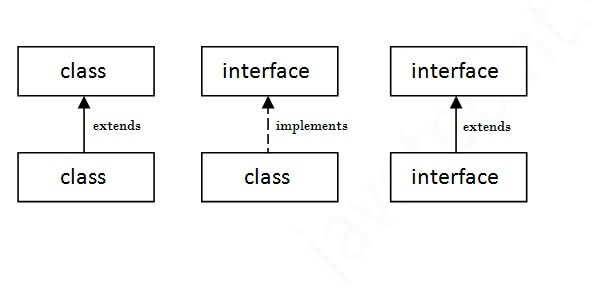

# Java

## 1. Runtime Polymorphism in Java

* Polymorphism is a technique wherein a single action can be performed in two different ways.

* Polymorphism in Java can be done in two ways, method **overloading** and method **overriding**. There are two types of polymorphism in Java.
  
  1. Compile-time polymorphism
    Compile-time polymorphism is a process in which a call to an **overridden** method is resolved at compile time. 

  2. Runtime polymorphism.
    Runtime polymorphism, also known as the **Dynamic Method Dispatch**, is a process that resolves a call to an **overridden method at runtime**. The process involves the use of the reference variable of a superclass to call for an overridden method.
* Upcasting
If the reference variable of Parent class refers to the object of Child class, it is known as upcasting.
``` java
class Bike{  
  void run(){System.out.println("running");}  
}  
class Splendor extends Bike{  
  void run(){System.out.println("running safely with 60km");}  
  
  public static void main(String args[]){  
    Bike b = new Splendor();//upcasting  
    b.run();  
  }  
}  
```

## 2. Exception
* In Java, an exception is an event that disrupts the normal flow of the program. It is an object which is thrown at runtime.


There are mainly two types of exceptions: checked and unchecked. An error is considered as the unchecked exception. However, according to Oracle, there are three types of exceptions namely:

 1. Checked Exception
  The classes that directly inherit the Throwable **class except RuntimeException** and Error are known as checked exceptions. For example, IOException, SQLException, etc. Checked exceptions are checked **at compile-time**.

 2. Unchecked Exception
   The classes that inherit the RuntimeException are known as unchecked exceptions. For example, ArithmeticException, NullPointerException, ArrayIndexOutOfBoundsException, etc. Unchecked exceptions are not **checked at compile-time, but they are checked at runtime.**
 
 3. Error
  Error is irrecoverable. Some example of errors are OutOfMemoryError, VirtualMachineError, AssertionError etc.


|Keyword|Description|
|:----|:----|
|try|The "try" keyword is used to specify a block where we should place an exception code. It means we can't use try block alone. The try block must be followed by either catch or finally.|
|catch|The "catch" block is used to handle the exception. It must be preceded by try block which means we can't use catch block alone. It can be followed by finally block later.|
|finally|The "finally" block is used to execute the necessary code of the program. It is executed whether an exception is handled or not.|
|throw|The "throw" keyword is used to throw an exception.|
|throws|The "throws" keyword is used to declare exceptions. It specifies that there may occur an exception in the method. It doesn't throw an exception. It is always used with method signature.|

 [Code Sample](examples/ExceptionSample.java)

 ``` java

 public class ExceptionSample {
    public static void main(String[] args) {
        System.out.println(print(1));
        System.out.println(print1(1)); <== has an error because print1 has throws in signature
    }

    static Exception print(int i){
        if (i>0) {
            return new Exception();
        } else {
            throw new RuntimeException();
        }
    }

    static  void print1(int i) throws Exception {
        if (i>0) {
            throw new Exception();
        } else {
            throw new RuntimeException();
        }
    }
}

 ```   

 ## 3. interface
 * An **interface in Java** is a blueprint of a class. It has static constants and abstract methods.

* In other words, you can say that interfaces can have abstract methods and **variables**. It cannot have a method body.

* It cannot be **instantiated** just like the abstract class.

* Since Java 8, we can have **default and static methods** in an interface.

* Since Java 9, we can have **private methods** in an interface.

* Why use Java interface?
  1. It is used to achieve abstraction.
  2. By interface, we can support the functionality of **multiple inheritance**.
  3. It can be used to achieve **loose coupling**.



[Code Sample](examples/InterfaceSample.java)

 ``` java

public class InterfaceSample {
     
    interface One {
        default void method() {
            System.out.println("One");
        }
    }
    
    interface Two {
        default void method () {
            System.out.println("One");
        }
    }
    class Three implements One, Two {

        public void method() {
            One.super.method();
            Two.super.method();
        }
    }
}
 ``` 

## 4. instanceof

* The java instanceof operator is used to test whether the object is an instance of the specified type (class or subclass or interface).

* The instanceof in java is also known as type comparison operator because it compares the instance with type. It returns either **true or false**. If we apply the instanceof operator with any variable that has null value, it returns false.

* If we apply instanceof operator with a variable that have null value, it returns **false**. Let's see the example given below where we apply instanceof operator with the variable that have null value.

``` java
  Dog2 d=null;  
  System.out.println(d instanceof Dog2);//false  
```
* Possibility of downcasting with instanceof
Let's see the example, where downcasting is possible by instanceof operator.

``` java
class Dog3 extends Animal {  
  static void method(Animal a) {  
    if(a instanceof Dog3){  
       Dog3 d=(Dog3)a;//downcasting  
       System.out.println("ok downcasting performed");  
    }  
  }  
```

* Downcasting without the use of java instanceof

``` java
class Animal { }  
class Dog4 extends Animal {  
  static void method(Animal a) {  
       Dog4 d=(Dog4)a;//downcasting  
       System.out.println("ok downcasting performed");  
  }  
   public static void main (String [] args) {  
    Animal a=new Dog4();  
    Dog4.method(a);  
  }  
}  

```

## 5. access modifiers 


## 6. final
* final keyword is used in different contexts. First of all, final is a **non-access modifier** applicable only to a variable, a method, or a class. The following are different contexts where final is used.

Non Access Modifiers are the keywords introduced in Java 7 to notify JVM about a class’s behaviour, methods or variables, etc. That helps introduce additional functionalities, such as the final keyword used to indicate that the variable **cannot be initialized twice**. There are a total of 7 non-access modifiers introduced.

1. Static
2. Final
3. Abstract
4. Synchronized
5. transient
6. strictfp
7. native


1. Final Variables
* When a variable is declared with the final keyword, its value can’t be **modified**, essentially, a constant. This also means that you must initialize a final variable. If the final variable is a reference, this means that the variable **cannot be re-bound to reference another object**, but the internal state of the object pointed by that reference variable can be changed i.e. **you can add or remove elements** from the final array or final collection.

There are three ways to initialize a final variable: 
1. You can initialize a final variable when it is declared. This approach is the most common. A final variable is called a blank final variable if it is not initialized while declaration. Below are the two ways to initialize a blank final variable.
2. A blank final variable can be initialized inside an instance-initializer block or inside the constructor. If you have more than one constructor in your class then it must be initialized in all of them, otherwise, a compile-time error will be thrown.
3. A blank final static variable can be initialized inside a static block.

``` java

class GFG {
    
    // a final variable
    // direct initialize
    final int THRESHOLD = 5;
      
    // a blank final variable
    final int CAPACITY;
      
    // another blank final variable
    final int  MINIMUM;
      
    // a final static variable PI
    // direct initialize
    static final double PI = 3.141592653589793;
      
    // a  blank final static  variable
    static final double EULERCONSTANT;
      
    // instance initializer block for 
    // initializing CAPACITY
    {
        CAPACITY = 25;
    }
      
    // static initializer block for 
    // initializing EULERCONSTANT
    static{
        EULERCONSTANT = 2.3;
    }
      
    // constructor for initializing MINIMUM
    // Note that if there are more than one
    // constructor, you must initialize MINIMUM
    // in them also
    public GFG() 
    {
        MINIMUM = -1;
    }
          
}

```

*Remember the below key points as perceived before moving forward as listed below as follows:

1. Note the difference between C++ const variables and Java final variables. const variables in **C++ must be assigned a value when declared**. For final variables in Java, it is not necessary as we see in the above examples. A final variable can be assigned **value later, but only once.**
2 . final with foreach loop: final with for-each statement **is a legal statement**.

### Final classes
* When a class is declared with final keyword, it is called a final class. A final class **cannot be extended(inherited)**. 

**Usage 1:** One is definitely to prevent inheritance, as final classes cannot be extended. For example, all Wrapper Classes like Integer, Float, etc. are final classes. We can not extend them.

``` java

final class A
{
     // methods and fields
}
// The following class is illegal
class B extends A 
{ 
    // COMPILE-ERROR! Can't subclass A
}

```

**Usage 2:** The other use of final with classes is to create an immutable class like the predefined String class. One can not make a class immutable without making it final.

* Immutable class in java means that once an object is created, we cannot change its content. In Java, all the wrapper classes (like Integer, Boolean, Byte, Short) and String class is immutable. Following are the requirements: 

1. The class must be declared as final so that child classes can’t be created.
2. Data members in the class must be declared **private** so that direct access is not allowed.
3. Data members in the class must be declared as **final so that we can’t change the value of it after object creation**.
4. A parameterized constructor should initialize all the fields performing a **deep copy** so that data members can’t be modified with an object reference.
5. Deep Copy of objects should be performed in the getter methods to return a copy rather than returning the actual object reference)

### Final Methods
* When a method is declared with final keyword, it is called a final method. A final method **cannot be overridden**. 


### finally keyword
* Just as final is a reserved keyword, so in the same way finally is also a reserved keyword in java i.e, we can’t use it as an identifier. The finally keyword is used in association with a try/catch block and guarantees that a section of code will be executed, even if an exception is thrown. 

``` java
class E{
  public static void main(String[] args){
    try{
      System.out.println("In try block");
      System.exit(0);
    }
    catch(ArithmeticException e){
      System.out.println("In catch block");
    }
    finally{
      System.out.println("finally block");
    }
  }
}
```
Here in the above program, finally, the block doesn’t execute. There is only one situation where finally block won’t be executed when we are using System.exit(0) method. When we are using System.exit(0) then JVM itself shutdown, hence in this case finally block won’t be executed. Here, the number within the parenthesis is known as the status code. **Instead of zero, we can take any integer value where zero means normal termination, and non-zero means abnormal termination.** Whether it is zero or non-zero, there is no change in the result and the effect is the same with respect to the program. 

### Finalize method

* It is a method that the Garbage Collector always calls just before the deletion/destroying of the object which is eligible for Garbage Collection, so as to perform clean-up activity. Clean-up activity means closing the resources associated with that object like Database Connection, Network Connection, or we can say resource de-allocation. Remember, it is not a reserved keyword. Once the finalized method completes immediately Garbage Collector destroys that object. finalize method is present in the Object class and its syntax is:

``` java
protected void finalize throws Throwable{}
```

* Since the Object class contains the finalize method, hence finalize method is **available for every Java class** since Object is the superclass of all Java classes. Since it is available for every java class hence Garbage Collector can call finalize method on any Java object Now, the finalize method which is present in the Object class, **has an empty implementation**, in our class clean-up activities are there, then we have to override this method to define **our own clean-up activities**. Cases related to finalizing method:

``` java
class Hi {
    public static void main(String[] args)
    {
        Hi j = new Hi();
 
        // Calling finalize method Explicitly.
        j.finalize();
 
        j = null;
 
        // Requesting JVM to call Garbage Collector method
        System.gc();
        System.out.println("Main Completes");
    }
 
    // Here overriding finalize method
    public void finalize()
    {
        System.out.println("finalize method overridden");
        System.out.println(10 / 0);
    }
}

Output:
exception in thread "main" java.lang.ArithmeticException:
/ by zero followed by stack trace.

```

* So the key point is: If the programmer calls finalize method while executing finalize method some unchecked exception rises, then JVM terminates the program abnormally by rising an exception. So in this case, the program **termination is Abnormal**.


 **If the garbage Collector calls finalize method while executing finalize method, some unchecked exception rises.**

 ``` java

 class RR {
    public static void main(String[] args)
    {
        RR q = new RR();
        q = null;
 
        // Requesting JVM to call Garbage Collector method
        System.gc();
        System.out.println("Main Completes");
    }
 
    // Here overriding finalize method
    public void finalize()
    {
        System.out.println("finalize method overridden");
        System.out.println(10 / 0);
    }
}

Output:

finalize method overridden
Main Completes
 ```
* So the key point is if Garbage Collector calls finalize method while executing finalize method some unchecked exception rises then JVM ignores that exception and the rest of the program will be continued normally. **So in this case the program termination is Normal and not abnormal.**

### Important points:

1. There is no guarantee about the time when finalize is called. It may be called any time after the object is not being referred anywhere (can be garbage collected).
2. JVM does not ignore all exceptions while executing finalize method, **but it ignores only unchecked exceptions**. If the corresponding catch block is there, then JVM won’t ignore any corresponding catch block and will be executed.
3. System.gc() is just a request to JVM to execute the Garbage Collector. It’s up to JVM to call Garbage Collector or not. Usually, JVM calls Garbage Collector when there **is not enough space available in the Heap area or when the memory is low.**

### compareTo

"a".compareTo("b") is -1

"a".compareTo("a") is 0

"b".compareTo("a") is 1

## ArrayList 
* ArrayList is a class in java.util package which implements dynamic-sized arrays.** ArrayList dynamically grows and shrinks in size on the addition and removal of elements respectively.** ArrayList inherits the AbstractList class and implements the List, RandomAccess and java.io.Serializable interface. Addition of elements to an ArrayList takes amortized constant time - O(1).

* When an ArrayList is created, its default **capacity or size is 10** if not provided by the user. The size of the ArrayList grows based on load factor and current capacity.

1. The Load Factor is a measure to decide when to increase its capacity. The default value of load factor of an ArrayList is 0.75f
2. ArrayList in Java expands its capacity after each threshold which is calculated as the product of current capacity and load factor of the ArrayList instance.

```
Threshold = (Load Factor) * (Current Capacity)
```

For example, if the user creates an ArrayList of size 10,

**Threshold = Load Factor * Current Capacity = 0.75 * 10 ≅ 7**


In Java 8 and later, the new capacity of the ArrayList is calculated to be 50% more than its old capacity.

``` 
new_capacity = old_capacity + (old_capacity >> 1)
```

For example, if the array size is 10 and it has reached the threshold value, we have to increase its capacity to add new elements. The new capacity will be 10 + (10 >> 1) => 10 + 5 => 15. Hence, the size is increased from 10 to 15.


``` java
import java.util.*;

class SortMethod {

  public static void main(String[] args) {
    ArrayList<String> names = new ArrayList<String>();
    names.add("Raj");
    names.add("Priya");
    names.add("Shashank");
    names.add("Ansh");
    System.out.println("Before sorting, names : " + names);

    //Sorting ArrayList in ascending order
    Collections.sort(names); //1
    names.sort(Comparator.comparing(String::toString))//2
    names.stream().sorted((s1, s2) -> s1.compareTo(s2)).collect(Collectors.toList())// 3
    System.out.println("After sorting, names : " + names);
  }
}

The implementation is iterative merge sort and takes O(n * log(n)).

```

### How to synchronize ArrayList in Java?

* Collections.synchronizedList
* CopyOnWriteArrayList

``` java

public class SynchronizedCounter {
    private int c = 0;

    public synchronized void increment() {
        c++;
    }

    public synchronized void decrement() {
        c--;
    }

    public synchronized int value() {
        return c;
    }
}

import java.util.*;

class SynchronizeExample {

  public static void main(String[] args) {
    List<String> arr = new ArrayList<String>();
    // adding elements to the list
    arr.add("Hello");
    arr.add("World");
    arr.add("in");
    arr.add("Java");

    // Synchronizing the ArrayList externally using
    // synchronizedList() method
    arr = Collections.synchronizedList(arr);

    synchronized (arr) {
      // It should be in synchronized block
      Iterator it = arr.iterator();

      // Iterating through the elements
      while (it.hasNext()) System.out.println(it.next());
    }
  }
}


import java.io.*;
import java.util.Iterator;
import java.util.concurrent.CopyOnWriteArrayList;

class SynchronizeUsingCopyOnWriteArrayList {

  public static void main(String[] args) {
    // creating a thread-safe ArrayList using
    // CopyOnWriteArrayist.
    CopyOnWriteArrayList<String> arr = new CopyOnWriteArrayList<String>();

    // Adding elements to synchronized ArrayList
    arr.add("Hello");
    arr.add("World");
    arr.add("in");
    arr.add("Java");

    System.out.println("Elements of synchronized ArrayList :");

    // Iterating on the synchronized ArrayList using an iterator.
    Iterator<String> it = arr.iterator();

    while (it.hasNext()) System.out.println(it.next());
  }
}

```

``` java
   ArrayList<String> words = new ArrayList<>(Arrays.asList("Hello", "World"));
```
### Difference Between Array and Arraylist

#### Array
* Length of Array is static that means one cannot change its length that has been already defined by the developer to that particular element. This Array needs to specify the size of the elements.  
* In other words, the length of the elements in the array is static or  requires more memory to store the elements and less time to iterate the elements. 
* Array does not allow generics, though multidimensional in nature. 
* In the array, giving references to objects or elements  depends upon the type of array such as primitive type or object type.
* Functions such as indexOf() and remove() are not supported by Arrays in Java.
#### ArrayList
* ArrayList uses the size() method to compute the size of the elements. Also, it is dynamic, which means one can change the size of the arraylist if the elements are modified in it, which means the length of the arraylist is variable. 
* ArrayList requires more memory to store the elements as well as more time to iterate. 
* ArraList enables the use of generic and single dimensional in nature. 
* In arrayList, we can convert the primitive int data type into an Integer object with the help of commands such as “arraylist.add(1)” as shown in example. 
* Since primitive data types can be created in ArrayList, the members of ArrayList are always given references to the  objects at every different memory locations . Thus, in ArrayList, the actual objects or elements are never stored at contiguous locations whereas their References can be stored at contiguous locations. 
* In ArrayList, primitive types have actual values with contiguous locations, however object type allocation is similar to ArrayList. 
Operations such as indexOf(), remove() are supported by ArrayList in Java.

## this vs super

* The **super** keyword is used to represent an instance of the **parent class** which is created implicitly for each object of the child class. The super keyword can be used to invoke the parent class methods and constructors. It can also be used to access the fields of the parent class.

* The **this** keyword is used to represent the **current instance of a class**. It is used to access the instance variables and invoke current class methods and constructors. The this keyword can be passed as an argument to a method call representing the current class instance.

[Refrence]([images/how-java-arraylist-works.webp](https://www.scaler.com/topics/java/this-and-super-keyword-in-java/))

### this

 [Code Sample](examples/ThisSample.java)

``` java 
 
public class ThisSample  {
    public static void main(String[] args) {
       
      Illustration obj = new Illustration();
      obj.Scaler();
      obj.name();

      System.out.println("Object  ......... 100 .........." );
      Illustration obj100 = new Illustration(100);
      obj100.Scaler();
      obj100.name();
      obj100.invoke();
      (new Illustration()).getIllustration().name();
    }

    
}

class Illustration {

  // declaring an instance variable
  int instanceVar = 5;

  // declaring an static variable
  static int staticVar = 10;

  Illustration() {
    // invoking parameterized constructor
    this(10);
  }

  Illustration(int x) {
    System.out.println("Current class parameterized constructor invoked.");
    System.out.println("Number is : " + x);
  }

  void print(Illustration ob) {
    System.out.println("ob.value = " + ob.instanceVar);
  }

  void invoke() {
    // print method is invoked by passing this as an argument
    print(this);
  }


  Illustration getIllustration() {
    // returing the instance of current class
    return this;
  }

  void Scaler() {
    // Method-specific variables
    int instanceVar = 20;
    int staticVar = 40;
      
    // referring to the current class instance and static variables
    this.instanceVar = 50;
    this.staticVar = 100;

    // printing the current class instance and static variable.
    System.out.println("Value of instance variable : " + this.instanceVar);
    System.out.println("Value of static variable : " + this.staticVar);
      
    // printing the method specific variables.
    System.out.println("instanceVar inside method : " + instanceVar);
    System.out.println("staticVar inside method: " + staticVar);
  }

  void name() {
    // invoking current class scaler method.
    System.out.println("Call ......... name method" );
    this.Scaler();
    System.out.println("Ahmad Aghazadeh.");
  }
}

``` 
### super


``` java
class A{
    void methodP(){
        // method
    }
}
class B extends A{
    void methodC(){
        // method
    }
}
class C extends B{
    void methodGC(){
        // method
    }
}
```
* Let us understand the concept of immediate parent. In the above code snippet of multi-level inheritance class B extends class A, it implies class A is immediate parent of class B. Similarly class C extends class B and now class C has two parents i.e., class A and class B, where class B is immediate parent of class C.

* The **super** is a special keyword in Java that is used to refer to the instance of the **immediate parent class**.

 [Code Sample](examples/ThisSample.java.java)

 ``` java
 
public class SuperSample  {
    public static void main(String[] args) {
       
      Child obj = new Child();
      obj.print();
    }

    
}
 
class Parent {

  int a = 50;
  String s = "Hello World!";
  void display() {
    System.out.println("Hi I am parent method.");
  }
  Parent() {
    System.out.println("Hi I am Parent class constructor.");
  }

}

// child class extending parent class
class Child extends Parent {

  Child() {
    // invoking parent class constructor
    super();
  }
  int a = 100;
  String s = "Happy Coding!";

  void print() {
    // referencing to the instance variable of parent class
    System.out.println("Number from parent class is : " + super.a);
    System.out.println("String from parent class is : " + super.s);

    // printing a and s of the current/child class
    System.out.println("Number from child class is : " + a);
    System.out.println("String from child class is : " + s);
    display();
    super.display();
  }
  void display() {
    System.out.println("Hi I am child method.");
  }
 
}

 ```

### Difference Between this and super Keyword in Java

|                                  **<span class="highlight--red">this</span>** keyword in Java|**<span class="highlight--red">super</span>** keyword in Java|
|:----|:----|
|    <span class="highlight--red">this</span> is an implicit reference variable keyword used to represent the current class.|<span class="highlight--red">super</span> is an implicit reference variable keyword used to represent the immediate parent class.|
|                      <span class="highlight--red">this</span> is to invoke methods of the current class.|<span class="highlight--red">super</span> is used to invoke methods of the immediate parent class.|
|                 <span class="highlight--red">this</span> is used to invoke a constructor of the current class.|<span class="highlight--red">super</span> is used to invoke a constructor of the immediate parent class.|
|           <span class="highlight--red">this</span> refers to the instance and static variables of the current class.|<span class="highlight--red">super</span> refers to the instance and static variables of the immediate parent class.|
|<span class="highlight--red">this</span> can be used to return and pass as an argument in the context of a current class object.|<span class="highlight--red">super</span> can be used to return and pass as an argument in the context of an immediate parent class object.|

## Anonymous Inner Class in Java
 * It is an inner class without a name and for which only a single object is created. An anonymous inner class can be useful when making an instance of an object with certain “extras” such as overriding methods of a class or interface, without having to actually subclass a class.
 * Anonymous inner classes are useful in writing implementation classes for listener interfaces in graphics programming. 

### Now let us do discuss the difference between regular class(normal classes) and Anonymous Inner class

1. A normal class can implement any number of interfaces but the anonymous inner class can implement **only one interface at a time**.
2. A regular class can extend a class and implement any number of interfaces simultaneously. But anonymous Inner class **can extend a class or can implement an interface but not both at a time**.
3. For regular/normal class, we can write any number of constructors but we can’t write any constructor for anonymous Inner class because the anonymous class does not have any name and while defining constructor class name and constructor name must be same.

### Based on declaration and behavior, there are 3 types of anonymous Inner classes: 

1. Anonymous Inner class that extends a class
``` java
  Thread t = new Thread() {
      
      // run() method for the thread
      public void run()
      {
          // Print statement for child thread
          // execution
          System.out.println("Child Thread");
      }
  };

  // Starting the thread
  t.start();

  // Displaying main thread only for readability
  System.out.println("Main Thread");
```
2. Anonymous Inner class that implements an interface
``` java
Runnable r = new Runnable() {
    
    // run() method for the thread
    public void run()
    {
        // Print statement when run() is invoked
        System.out.println("Child Thread");
    }
};

// Creating thread in main() using Thread class
Thread t = new Thread(r);

// Starting the thread using start() method
// which invokes run() method automatically
t.start();
```

3. Anonymous Inner class that defines inside method/constructor argument
``` java
Thread t = new Thread(new Runnable() {
    
    public void run()
    {
        System.out.println("Child Thread");
    }
});

t.start();
```

## volatile
* Using volatile is yet another way (like synchronized, atomic wrapper) of making class thread-safe. Thread-safe means that a method or class instance can be used by multiple threads at the same time without any problem. The volatile keyword can be used either with **primitive type or objects**.
* The volatile keyword **does not cache** the value of the variable and **always read the variable from the main memory**. The volatile keyword cannot be used with classes or methods.

``` java
class Test  
{  
  static int var=5;  
}  
```
*In the above example, assume that two threads are working on the same class. Both threads run on different processors where each thread has its local copy of var. If any thread modifies its value, the change will not reflect in the original one in the main memory. It leads to data inconsistency because the other thread is not aware of the modified value.

``` java
class Test  
{  
  static volatile int var =5;  
}  
```
* In the above example, static variables are class members that are shared among all objects. There is only one copy in the main memory. The value of a volatile variable will never be stored in the cache. All read and write will be done from and to the main memory.

### Difference between synchronization and volatile keyword

**Mutual Exclusion:** It means that only one thread or process can execute a block of code (**critical section**) at a time.
**Visibility:** It means that changes made by one thread to shared data are visible to other threads.
**Java’s synchronized keyword guarantees both mutual exclusion and visibility.** If we make the blocks of threads that modify the value of the shared variable synchronized only one thread can enter the block and changes made by it will be reflected in the main memory. All other threads trying to enter the block at the same time will be blocked and put to sleep. 

In some cases, we may only desire visibility and not atomicity. The use of synchronized in such a situation is overkill and may cause scalability problems. Here volatile comes to the rescue. **Volatile variables have the visibility features of synchronized but not the atomicity features**. The values of the volatile variable will never be cached and all writes and reads will be done to and from the main memory. However, the use of volatile is limited to a very restricted set of cases as most of the times atomicity is desired. For example, a simple increment statement such as x = x + 1; or x++ seems to be a single operation but is really a compound read-modify-write sequence of operations that **must execute atomically**. 


|Volatile Keyword|Synchronization Keyword|
|:----|:----|
|Volatile keyword is a field modifier.|Synchronized keyword modifies code blocks and methods.|
|The thread cannot be blocked for waiting in case of volatile.|Threads can be blocked for waiting in case of synchronized.|
|It improves thread performance.|Synchronized methods degrade the thread performance.|
|It synchronizes the value of one variable at a time between thread memory and main memory.|It synchronizes the value of all variables between thread memory and main memory.|
|Volatile fields are not subject to compiler optimization.|Synchronize is subject to compiler optimization.|
## java.lang.UnsupportedClassVersionError
* The UnsupportedClassVersionError is a sub-class of the LinkageError and thrown by the Java Virtual Machine (JVM). When a class file is read and when major and minor version numbers are not supported, this error is thrown, a**nd especially during the linking phase, this error is thrown**

**When we tried to compile a program using a higher version of Java and execute it using a JVM of a lower version, this error is thrown**

## Java is Pass by Value, Not Pass by Reference
Technically, Java is always pass by value, because even though a variable might hold a reference to an object, that object reference is a value that represents the object’s location in memory. Object references are therefore passed by value.

**Both reference data types and primitive data types are passed by value.**

## native

* The native keyword in Java is applied to a method to indicate that the method is implemented in native code using JNI (Java Native Interface). The native keyword is a modifier that is applicable only for methods, and we can’t apply it anywhere else. The methods which are implemented in C, C++ are called native methods or foreign methods.

* The native modifier indicates that a method is implemented in platform-dependent code, often seen in C language. Native modifier indicates that a method is implemented in platform-dependent code, often in C.

### Main objectives of the native keyword
1. To improve the performance of the system.
2. To achieve machine level/memory level communication.
3. To use already existing legacy non-java code.

## advantages & disadvantage of inheritance

### Advantages of Inheritance in OOPS
1. The main advantage of the inheritance is that it helps in reusability of the code. The codes are defined only once and can be used multiple times. In java we define the super class or base class in which we define the functionalities and any number of child classes can use the functionalities at any time.
2. Through inheritance a lot of time and efforts are being saved.
3. It improves the program structure which can be readable.
4. The program structure is short and concise which is more reliable.
5. The codes are easy to debug. Inheritance allows the program to capture the bugs easily
6. Inheritance makes the application code more flexible to change.
7. Inheritance results in better organisation of codes into smaller, simpler and simpler compilation units.
### Disadvantages of Inheritance in OOPS
1. The main disadvantage of the inheritance is that the two classes(base class and super class) are tightly coupled that is the classes are dependent on each other.
2. If the functionality of the base class is changed then the changes have to be done on the child classes also.
3. If the methods in the super class are deleted then it is very difficult to maintain the functionality of the child class which has implemented the super class’s method.
4. It increases the time and efforts take to jump through different levels of the inheritance.

## lambda 
Lambda Expressions were added in Java 8.

A lambda expression is a short block of code which takes in parameters and returns a value. Lambda expressions are similar to methods, but they do not need a name and they can be implemented right in the body of a method.


``` java

parameter -> expression

(parameter1, parameter2) -> expression


(parameter1, parameter2) -> { code block }

Function<Integer, Integer> squareLambda = x -> x * x;

```

## hashcode
* Simply put, hashCode() returns an integer value, generated by a hashing algorithm.

* Objects that are equal (according to their equals()) must return the same hash code. Different objects do not need to return different hash codes.

## Is-A(inheritance) and Has-A(composition) Relationship in Java

* In Java, we can reuse our code using an Is-A relationship or using a Has-A relationship. An **Is-A relationship is also known as inheritance** and a **Has-A relationship is also known as composition** in Java.
 
 

 ### Garbage Collection in Java

 * The main objective of Garbage Collector is to free heap memory by destroying unreachable objects. The garbage collector is the best example of the **Daemon thread** as it is always running in the background. 

Two types of garbage collection activity usually happen in Java.

1. **Minor or incremental Garbage Collection:** It is said to have occurred when unreachable objects in the young generation heap memory are removed.
2. **Major or Full Garbage Collection:** It is said to have occurred when the objects that survived the minor garbage collection are copied into the old generation or permanent generation heap memory are removed. When compared to the young generation, garbage collection happens less frequently in the old generation.

**Unreachable objects:** An object is said to be unreachable if it doesn’t contain any reference to it. Also, note that objects which are part of the island of isolation are also unreachable. 

 

**Eligibility for garbage collection:** An object is said to be eligible for GC(garbage collection) if it is unreachable. After i = null, integer object 4 in the heap area is suitable for garbage collection in the above image.

### Ways to make an object eligible for Garbage Collector
1. Nullifying the reference variable
2. Re-assigning the reference variable
3. An object created inside the method
4. Island of Isolation

* Once we make an object eligible for garbage collection, **it may not destroy immediately by the garbage collector**. Whenever JVM runs the Garbage Collector program, then only the object will be destroyed. But when JVM runs Garbage Collector, we can not expect.

1. Using **System.gc()** method: System class contain static method gc() for requesting JVM to run Garbage Collector.
2. Using **Runtime.getRuntime().gc()** method: Runtime class allows the application to interface with the JVM in which the application is running. Hence by using its gc() method, we can request JVM to run Garbage Collector.
3. There is no guarantee that any of the above two methods will run Garbage Collector.
4. The call System.gc() is effectively equivalent to the call : Runtime.getRuntime().gc(). **The only difference is System.gc() is a class method where as Runtime.gc() is an instance method. So, System.gc() is more convenient.**


Set references to null(i.e X = Y = null;)
Call, System.gc();
Call, System.runFinalization();

 [Code Sample](examples/GarbageCollectorSample.java)

 ### Daemon Thread in Java
* Daemon thread in Java is a low-priority thread that runs in the background to perform tasks such as garbage collection. Daemon thread in Java is also a service provider thread that provides services to the user thread. Its life depends on the mercy of user threads i.e. when all the user threads die, JVM terminates this thread automatically.

#### Default Nature of Daemon Thread
* By default, the main thread is always non-daemon but for all the remaining threads, daemon nature will be inherited from parent to child. That is, if the parent is Daemon, the child is also a Daemon and if the parent is a non-daemon, then the child is also a non-daemon.
* Note: Whenever the last non-daemon thread terminates, all the daemon threads will be terminated automatically.

#### Methods of Daemon Thread
1. void setDaemon(boolean status): 
This method marks the current thread as a daemon thread or user thread. For example, if I have a user thread tU then tU.setDaemon(true) would make it a Daemon thread. On the other hand, if I have a Daemon thread tD then calling tD.setDaemon(false) would make it a user thread. 
2. boolean isDaemon(): 
This method is used to check that the current thread is a daemon. It returns true if the thread is Daemon. Else, it returns false. 

``` java
public class DaemonThread extends Thread
{
    public DaemonThread(String name){
        super(name);
    }
  
    public void run()
    {
        // Checking whether the thread is Daemon or not
        if(Thread.currentThread().isDaemon())
        {
            System.out.println(getName() + " is Daemon thread");
        }
          
        else
        {
            System.out.println(getName() + " is User thread");
        }
    }
      
    public static void main(String[] args)
    {
      
        DaemonThread t1 = new DaemonThread("t1");
        DaemonThread t2 = new DaemonThread("t2");
        DaemonThread t3 = new DaemonThread("t3");
      
        // Setting user thread t1 to Daemon
        t1.setDaemon(true);
              
        // starting first 2 threads
        t1.start();
        t2.start();
  
        // Setting user thread t3 to Daemon
        t3.setDaemon(true);
        t3.start();        
    }
}

Output: 

t1 is Daemon thread
t3 is Daemon thread
t2 is User thread

```
#### Exceptions in a Daemon thread 
If you call the setDaemon() method after starting the thread, it would throw **IllegalThreadStateException**.

## Reflection
Reflection is an API that is used to **examine or modify the behavior of methods, classes, and interfaces at runtime**. The required classes for reflection are provided under java.lang.reflect package which is essential in order to understand reflection.

 

  Reflection can be used to get information about class, constructors, and methods as depicted below in tabular format as shown:
**Class:** The **getClass() or Class.forName("Test")** method is used to get the name of the class to which an object belongs.
**Constructors:** The getConstructors() method is used to get the public constructors of the class to which an object belongs.

**Methods:** The getMethods() method is used to get the public methods of the class to which an object belongs.

* We can invoke a method through reflection if we know its name and parameter types. We use two methods for this purpose as described below before moving ahead as follows

``` java
Class.getDeclaredMethod(name, parametertype)
Method.invoke(Object, parameter)
```
**Tip:** If the method of the class doesn’t accept any parameter then null is passed as an argument.
**Note:** Through reflection, we can access the private variables and methods of a class with the help of its class object and invoke the method by using the object as discussed above. We use below two methods for this purpose.

 **Field.setAccessible(true):** Allows to access the field irrespective of the access modifier used with the field.

 [Code Sample](examples/ReflectionSample.java)

 ``` java

import java.lang.reflect.Constructor;
import java.lang.reflect.Field;
import java.lang.reflect.Method;
import java.util.ArrayList;
// Class 1
// Of Whose object is to be created
class Test {
    // creating a private field
    private String s;
  
    // Constructor of this class
  
    // Constructor 1
    // Public constructor
    public Test() { s = "Ahmad Aghazadeh Test Class"; }
  
    // Constructor 2
    // no arguments
    public void method1()
    {
        System.out.println("The string is " + s);
    }
  
    // Constructor 3
    // int as argument
    public void method2(int n)
    {
        System.out.println("The number is " + n);
    }
  
    // Constructor 4
    // Private method
    private void method3()
    {
        System.out.println("Private method invoked");
    }
}
  
// Class 2
// Main class
class ReflectionSample {
  
    // Main driver method
    public static void main(String args[]) throws Exception
    {
        // Creating object whose property is to be checked
  
        // Creating an object of class 1 inside main()
        // method
        Test obj = new Test();
  
        // Creating class object from the object using
        // getClass() method
        Class cls = obj.getClass();

        // OR
        Class<?> clazz = Class.forName("Test");
  
        // Printing the name of class
        // using getName() method
        System.out.println("The name of class is "
                           + cls.getName());

        System.out.println("The name of class is "
                           + clazz.getName()+" Class.forName");
  
        // Getting the constructor of the class through the
        // object of the class
        Constructor constructor = cls.getConstructor();
  
        // Printing the name of constructor
        // using getName() method
        System.out.println("The name of constructor is "
                           + constructor.getName());
  
        // Display message only
        System.out.println(
            "The public methods of class are : ");
  
        // Getting methods of the class through the object
        // of the class by using getMethods
        Method[] methods = cls.getMethods();
  
        // Printing method names
        for (Method method : methods)
            System.out.println(method.getName());
  
        // Creates object of desired method by
        // providing the method name and parameter class as
        //  arguments to the getDeclaredMethod() method
        Method methodcall1
            = cls.getDeclaredMethod("method2", int.class);
  
        // Invoking the method at runtime
        methodcall1.invoke(obj, 19);
  
        // Creates object of the desired field by
        // providing the name of field as argument to the
        // getDeclaredField() method
        Field field = cls.getDeclaredField("s");
  
        // Allows the object to access the field
        // irrespective of the access specifier used with
        // the field
        field.setAccessible(true);
  
        // Takes object and the new value to be assigned
        // to the field as arguments
        field.set(obj, "JAVA");
  
        // Creates object of desired method by providing the
        // method name as argument to the
        // getDeclaredMethod()
        Method methodcall2
            = cls.getDeclaredMethod("method1");
  
        // Invokes the method at runtime
        methodcall2.invoke(obj);
  
        // Creates object of the desired method by providing
        // the name of method as argument to the
        // getDeclaredMethod() method
        Method methodcall3
            = cls.getDeclaredMethod("method3");
  
        // Allows the object to access the method
        // irrespective of the access specifier used with
        // the method
        methodcall3.setAccessible(true);
  
        // Invoking the method at runtime
        methodcall3.invoke(obj);

        final var test = new ArrayList(10);
        Class<?> goatClass = test.getClass();
        Package pkg = goatClass.getPackage();

        System.out.println("Package name is "+
            pkg.getName());
    }
}
 ```
* get Packename
 ``` java
    Test test = new Goat("goat");
    Class<?> goatClass = test.getClass();
    Package pkg = test.getPackage();
 ```
## Hashset
The HashSet class implements the Set interface, backed by a hash table which is actually a HashMap instance. No guarantee is made as to the iteration order of the set which means that the class does not guarantee the constant order of elements over time.

* HashSet stores the elements by using a mechanism called hashing.
* HashSet contains unique elements only.
* HashSet allows null value.
* HashSet class is non synchronized.
* HashSet doesn't maintain the insertion order. Here, elements are inserted on the basis of their hashcode.
* HashSet is the best approach for search operations.
* The initial default capacity of HashSet is 16, and the load factor is 0.75.
* HashSet also implements Serializable and Cloneable interfaces.

### Difference between List and Set
A list can contain duplicate elements whereas Set contains unique elements only.

``` java
Set s = Collections.synchronizedSet(new HashSet(...));

HashSet<E> hs = new HashSet<E>(int initialCapacity, float loadFactor);

``` 

### HashSet vs HashMap

|BASIS|HashSet|HashMap|
|:----|:----|:----|
|_Implementation_|HashSet implements Set interface.|HashMap implements Map interface.|
|_Duplicates_|HashSet doesn’t allow duplicate values.|HashMap store key, value pairs and it does not allow duplicate keys. If key is duplicate then the old key is replaced with the new value.|
|_Number of objects during storing objects_|HashSet requires only one object add(Object o).|HashMap requires two objects put(K key, V Value) to add an element to the HashMap object.|
|_Dummy value_|HashSet internally uses HashMap to add elements. In HashSet, the argument passed in add(Object) method serves as key K. Java internally associates dummy value for each value passed in add(Object) method.|HashMap does not have any concept of dummy value.|
|_Storing or Adding mechanism_|HashSet internally uses the HashMap object to store or add the objects.|HashMap internally uses hashing to store or add objects|
|_Faster_|HashSet is slower than HashMap.|HashMap is faster than HashSet.|
|_Insertion_|HashSet uses the add() method for add or storing data.|HashMap uses the put() method for storing data.|
|_Example_|HashSet is a set, e.g. {1, 2, 3, 4, 5, 6, 7}.|HashMap is a key -> value pair(key to value) map, e.g. {a -> 1, b -> 2, c -> 2, d -> 1}.|

### HashSet vs TreeSet


|BASIS|HashSet|TreeSet|
|:----|:----|:----|
|_Speed and internal implementation_|For operations like search, insert and delete. It takes constant time for these operations on average. HashSet is faster than TreeSet. HashSet is Implemented using a hash table.|TreeSet takes O(Log n) for search, insert and delete which is higher than HashSet. **But TreeSet keeps sorted data.** **Also, it supports operations like higher() (Returns least higher element), floor(), ceiling(), etc. These operations are also O(Log n) in TreeSet and not supported in HashSet. TreeSet is implemented using a Self Balancing Binary Search Tree (Red-Black Tree). TreeSet is backed by TreeMap in Java.**|
|_Ordering_|&nbsp; Elements in HashSet are not ordered.|TreeSet maintains objects in Sorted order defined by either Comparable or Comparator method in Java. TreeSet elements are sorted in ascending order by default. It offers several methods to deal with the ordered set like first(), last(), headSet(), tailSet(), etc.|
|_Null Object_|HashSet allows the null object.|TreeSet doesn’t allow null Object and throw NullPointerException, Why, because TreeSet uses compareTo() method to compare keys and compareTo() will throw java.lang.NullPointerException.|
|_Comparison_|HashSet uses equals() method to compare two objects in Set and for detecting duplicates.|TreeSet uses compareTo() method for same purpose. If equals() and compareTo() are not consistent, i.e. for two equal object equals should return true while compareTo() should return zero, then it will break the contract of the Set interface and will allow duplicates in Set implementations like TreeSet|

## PriorityQueue
* A PriorityQueue is used when the objects are supposed to be processed based on the priority. It is known that a Queue follows the First-In-First-Out algorithm, but sometimes the elements of the queue are needed to be processed according to the priority, that’s when the PriorityQueue comes into play.

* The PriorityQueue is based on the priority heap. The elements of the priority queue are ordered according to the natural ordering, or by a Comparator provided at queue construction time, depending on which constructor is used.  

### A few important points on Priority Queue are as follows: 

* PriorityQueue doesn’t permit null.
* We **can’t** create a PriorityQueue of Objects that are **non-comparable**
* PriorityQueue are unbound queues.
* The head of this queue is the least element with respect to the specified ordering. If multiple elements are tied for the least value, the head is one of those elements — ties are broken arbitrarily.
* Since PriorityQueue is **not thread-safe**, java provides **PriorityBlockingQueue** class that implements the BlockingQueue interface to use in a java **multithreading** environment.
* The queue retrieval operations **poll,  remove,  peek**, and element access the element at the **head of the queue**.
* It provides O(log(n)) time for add and poll methods.
* It inherits methods from AbstractQueue, AbstractCollection, Collection, and Object class.

## Stream

* Introduced in Java 8, the Stream API is used to process collections of objects. A stream is a sequence of objects that supports various methods which can be pipelined to produce the desired result.

* A stream is not a data structure instead it takes input from the Collections, Arrays or I/O channels.
* Streams don’t change the original data structure, they only provide the result as per the pipelined methods.
* Each intermediate operation is lazily executed and returns a stream as a result, hence various intermediate operations can be pipelined. Terminal operations mark the end of the stream and return the result.

### Intermediate Operations:

**map:** The map method is used to returns a stream consisting of the results of applying the given function to the elements of this stream.
List number = Arrays.asList(2,3,4,5);
List square = number.stream().map(x->x*x).collect(Collectors.toList());
**filter:** The filter method is used to select elements as per the Predicate passed as argument.
List names = Arrays.asList("Reflection","Collection","Stream");
List result = names.stream().filter(s->s.startsWith("S")).collect(Collectors.toList());
**sorted:** The sorted method is used to sort the stream.
List names = Arrays.asList("Reflection","Collection","Stream");
List result = names.stream().sorted().collect(Collectors.toList());

### Terminal Operations:

**collect:** The collect method is used to return the result of the intermediate operations performed on the stream.
List number = Arrays.asList(2,3,4,5,3);
Set square = number.stream().map(x->x*x).collect(Collectors.toSet());
**forEach:** The forEach method is used to iterate through every element of the stream.
List number = Arrays.asList(2,3,4,5);
number.stream().map(x->x*x).forEach(y->System.out.println(y));
**reduce:** The reduce method is used to reduce the elements of a stream to a single value.
The reduce method takes a BinaryOperator as a parameter. 
List number = Arrays.asList(2,3,4,5);
int even = number.stream().filter(x->x%2==0).reduce(0,(ans,i)-> ans+i);

Here ans variable is assigned 0 as the initial value and i is added to it .

### Important Points/Observations:

* A stream consists of source followed **by zero or more intermediate methods combined** together (pipelined) and a terminal method to process the objects obtained from the source as per the methods described.
* Stream is used to compute elements as per the pipelined methods **without altering** the original value of the object.

## enum

* Enumerations serve the purpose of representing a group of named constants in a programming language.

* Enums are used when we know all possible values at compile time, such as choices on a menu, rounding modes, command-line flags, etc. It is not necessary that the set of constants in an enum type stay **fixed** for all time.

* A Java enumeration is a class type. Although we don’t need to instantiate an enum using new, it has the same capabilities as other classes. This fact makes Java enumeration a very powerful tool. Just like classes, you can give them **constructor, add instance variables and methods, and even implement interfaces**.

* One thing to keep in mind is that, unlike classes, enumerations neither inherit other classes nor can get extended(i.e become superclass). 

``` java
enum TrafficSignal
{
    // This will call enum constructor with one
    // String argument
    RED("STOP",1), GREEN("GO",2), ORANGE("SLOW DOWN",3);
  
    // declaring private variable for getting values
    private String action;
    private int index;
  
    // getter method
    public String getAction()
    {
        return this.action;
    }

    public int getIndex()
    {
        return this.index;
    }
  
    // enum constructor - cannot be public or protected
    private TrafficSignal(String action,int index)
    {
        this.action = action;
        this.index=index;
    }
}
  
```

## Try-with-resources
* In Java, the Try-with-resources statement is a try statement that declares one or more resources in it. A resource is an object that must be closed once your program is done using it. For example, a File resource or a Socket connection resource.  The try-with-resources statement ensures that each resource is closed at the end of the statement execution. If we don’t close the resources, it may constitute a resource leak and also the program could exhaust the resources available to it.

* You can pass any object as a resource that implements `java.lang.AutoCloseable`, which includes all objects which implement `java.io.Closeable`.

* By this, now we don’t need to add an extra finally block for just passing the closing statements of the resources. The resources will be closed as soon as the try-catch block is executed. 

``` java
try(declare resources here) {
    // use resources
}
catch(FileNotFoundException e) {
    // exception handling
}
```

## Modifying a collection while iterating through it can throw a ConcurrentModificationException.

``` java

List<String> list = new ArrayList<String>(Arrays.asList("a", "b", "c"));
for(String value :list) {
    if(value.equals("a")) {
        list.remove(value);
    }
}
System.out.println(list); // outputs [b,c]

```

## Optional

Every Java Programmer is familiar with `NullPointerException`. It can crash your code. And it is very hard to avoid it without using too many null checks. So, to overcome this, Java 8 has introduced a new class Optional in `java.util` package. It can help in writing a neat code without using too many null checks. By using Optional, we can specify alternate values to return or alternate code to run. This makes the code more readable because the facts which were hidden are now visible to the developer.

``` java
String[] words = new String[10];
Optional<String> checkNull
    = Optional.ofNullable(words[5]);
if (checkNull.isPresent()) {
    String word = words[5].toLowerCase();
    System.out.print(word);
}
else
    System.out.println("word is null");
outPut:
word is null


Optional<String> empty = Optional.empty();
System.out.println(empty);

outPut:
Optional.empty

```

## Assert

* An assertion allows testing the correctness of any assumptions that have been made in the program. An assertion is achieved using the assert statement in Java. While executing assertion, it is believed to be true. If it fails, JVM throws an error named AssertionError. It is mainly used for testing purposes during development. 

The assert statement is used with a Boolean expression and can be written in two different ways.

``` java
assert expression;
assert expression1 : expression2;

class Test {
    public static void main(String args[])
    {
        int value = 15;
        assert value >= 20 : " Underweight";
        System.out.println("value is " + value);
    }
}

```

**Output**

value is 15

After enabling assertions:

**Output:** 

Exception in thread "main" java.lang.AssertionError: Underweight

* Enabling Assertions  

By default, assertions are disabled. We need to run the code as given. The syntax for enabling assertion statement in Java source code is: 

``` bash
java –ea Test
java –enableassertions Test

java –da Test
java –disableassertions Test
```

* Assertions are mainly used to check logically impossible situations. For example, they can be used to check the state a code expects before it starts running or the state after it finishes running. Unlike normal exception/error handling, assertions are generally disabled at run-time. 

## Function interface

* The Function Interface is a part of the java.util.function package which has been introduced since Java 8, to implement functional programming in Java. It represents a function which takes in one argument and produces a result. Hence this functional interface takes in 2 generics namely as follows:

T: denotes the type of the input argument
R: denotes the return type of the function

**apply()**

``` java
Function<Integer, Double> half = a -> a / 2.0;

// Applying the function to get the result
System.out.println(half.apply(10));

Output
5.0
```

andThen()

* It returns a composed function wherein the parameterized function will be executed after the first one. If evaluation of either function throws an error, it is relayed to the caller of the composed function.

``` java
		    Function<Integer, Double> half = a -> a / 2.0;
 
        // Now treble the output of half function
        half = half.andThen(a -> 5 * a);
		
		    half = half.andThen(a -> a+1);
        // Applying the function to get the result
        // and printing on console
        System.out.println(half.apply(10));//26

```
compose()

* It returns a composed function wherein the parameterized function will be executed first and then the first one. If evaluation of either function throws an error, it is relayed to the caller of the composed function.

``` java
		Function<Integer, Double> half = a -> a / 2.0;
 
        // However treble the value given to half function
        half = half.compose(a -> 3 * a);

		half = half.andThen(a -> a+1);
 
        // Applying the function to get the result
        System.out.println(half.apply(5)); // 8.5
```

* As you can see, the difference between compose and andThen is the order they execute the functions. While the compose function executes the caller last and the parameter first, the andThen executes the caller first and the parameter last.

andThen -> first to end

compose -> end to first;

**identity()**

* This method returns a function that returns its only argument.

``` java
Function<Integer, Integer> i = Function.identity();
 
        // Print statement
System.out.println(i.apply(10)); //10
```

## Consumer

* The Consumer Interface is a part of the java.util.function package which has been introduced since Java 8, to implement functional programming in Java. It represents a function which takes in one argument and produces a result. However these kind of functions don’t return any value.

* **Consumer likes Function but it doesn't have compose and return value.**
``` java
Consumer<List<Integer> > modify = list ->
{
    for (int i = 0; i < list.size(); i++)
        list.set(i, 2 * list.get(i));
};

// Consumer to display a list of integers
Consumer<List<Integer> >
    dispList = list -> list.stream().forEach(a -> System.out.print(a + " "));

List<Integer> list = new ArrayList<Integer>();
list.add(2);
list.add(1);
list.add(3);

// using addThen()
modify.andThen(dispList).accept(list);
```

## Predicate

* A Functional Interface is an Interface which allows only one Abstract method within the Interface scope. There are some predefined functional interface in Java like Predicate, consumer, supplier etc. The return type of a Lambda function (introduced in JDK 1.8) is a also functional interface.

The Functional Interface PREDICATE is defined in the **java.util.function** package. It improves manageability of code, helps in **unit-testing** them separately, and contain some methods like:

1. isEqual(Object targetRef) : Returns a predicate that tests if two arguments are equal according to Objects.equals(Object, Object). 
2. and(Predicate other) : Returns a composed predicate that represents a short-circuiting logical AND of this predicate and another.
3. negate() : Returns a predicate that represents the logical negation of this predicate.
4. or(Predicate other) : Returns a composed predicate that represents a short-circuiting logical OR of 5. test(T t) : Evaluates this predicate on the given argument.boolean test(T t)
test(T t) 
 
##  Supplier

* Java 8 Supplier is a functional interface whose functional method is **get()**. The Supplier interface represents an operation that takes no argument and returns a result. As this is a functional interface and can therefore be used as the assignment target for a lambda expression or method reference.

```java
Supplier<Boolean> boolSupplier = () -> product.length() == 10;
Supplier<Integer> intSupplier = () -> product.length() - 2;
Supplier<String> supplier = () -> product.toUpperCase();


System.out.println(boolSupplier.get());//false
System.out.println(intSupplier.get());//5
System.out.println(supplier.get());//ANDROID

//-------------------------------

public static void main(String[] args) {
    
    Supplier<Integer> supplier = SupplierDemo::getTwoDigitRandom;

    System.out.println(supplier.get());
    
}

public static Integer getTwoDigitRandom() {
    
    int random = new Random().nextInt(100);
    
    if(random < 10)
        return 10;
    
    return random;
}

//----------------------------
  static String product = "Android";
  static double price = 659.50;

BooleanSupplier boolSupplier = () -> product.length() == 10;
IntSupplier intSupplier = () -> product.length() - 2;
DoubleSupplier doubleSupplier = () -> price -20;
LongSupplier longSupplier = () -> new Date().getTime();
Supplier<String> supplier = () -> product.toUpperCase();


System.out.println(boolSupplier.getAsBoolean());//false
System.out.println(intSupplier.getAsInt());//5
System.out.println(doubleSupplier.getAsDouble());//639.5
System.out.println(longSupplier.getAsLong());// 1581187440978 (it depends on current time)
System.out.println(supplier.get());//ANDROID
```

## Comparable

* The Comparable interface is used to compare an object of the same class with an instance of that class, it provides ordering of data for objects of the user-defined class. The class has to implement the java.lang.Comparable interface to compare its instance, it provides the compareTo method that takes a parameter of the object of that class. In this article, we will see how we can sort an array of pairs of different data types on the different parameters of comparison.

``` java

import java.io.*;
import java.util.*;
 
class Pair implements Comparable<Pair> {
    String x;
    int y;
 
    public Pair(String x, int y)
    {
        this.x = x;
        this.y = y;
    }
 
    public String toString()
    {
        return "(" + x + "," + y + ")";
    }
 
    @Override public int compareTo(Pair a)
    {
        // if the string are not equal
        if (this.x.compareTo(a.x) != 0) {
            return this.x.compareTo(a.x);
        }
        else {
            // we compare int values
            // if the strings are equal
            return this.y - a.y;
        }
    }
}
 
public class GFG {
    public static void main(String[] args)
    {
 
        int n = 4;
        Pair arr[] = new Pair[n];
 
        arr[0] = new Pair("abc", 3);
        arr[1] = new Pair("a", 4);
        arr[2] = new Pair("bc", 5);
        arr[3] = new Pair("a", 2);
 
        // Sorting the array
        Arrays.sort(arr);
 
        // printing the
        // Pair array
        print(arr);
    }
 
    public static void print(Pair[] arr)
    {
        for (int i = 0; i < arr.length; i++) {
            System.out.println(arr[i]);
        }
    }
}

Before Sorting:
(abc, 3);
(a, 4);
(bc, 5);
(a, 2);

After Sorting:
(a,2)
(a,4)
(abc,3)
(bc,5)

```

##  Callable

* There are two ways of creating threads – one by extending the Thread class and other by creating a thread with a **Runnable**. However, one feature lacking in  Runnable is that we cannot make a thread return result when it terminates, i.e. when run() completes. For supporting this feature, the **Callable** interface is present in Java.

``` java

public class CallableSample
{
  public static void main(String[] args) throws Exception
  {
  
    // FutureTask is a concrete class that
    // implements both Runnable and Future
    FutureTask[] randomNumberTasks = new FutureTask[5];
  
    for (int i = 0; i < 5; i++)
    {
      Callable callable = new CallableRondom();
  
      // Create the FutureTask with Callable
      randomNumberTasks[i] = new FutureTask(callable);
  
      // As it implements Runnable, create Thread
      // with FutureTask
      Thread t = new Thread(randomNumberTasks[i]);
      t.start();
    }
  
    for (int i = 0; i < 5; i++)
    {
      // As it implements Future, we can call get()
      System.out.println(randomNumberTasks[i].get());
  
      // This method blocks till the result is obtained
      // The get method can throw checked exceptions
      // like when it is interrupted. This is the reason
      // for adding the throws clause to main
    }
  }
}
class CallableRondom implements Callable
{
  
  public Object call() throws Exception
  {
    Random generator = new Random();
    Integer randomNumber = generator.nextInt(5);
  
    Thread.sleep(randomNumber * 1000);
  
    return randomNumber;
  }
  
}
  


```
## UnaryOprator

* The UnaryOperator Interface<T> is a part of the java.util.function package which has been introduced since Java 8, to implement functional programming in Java. It represents a function which takes in one argument and operates on it. However what distinguishes it from a normal Function is that both its argument **and return type are the same**.

``` java
List<String> dates = new ArrayList<String>();
UnaryOperator<String> replaceSlashes = date -> date.replace("/", "-");
dates.replaceAll(replaceSlashes);
```

## Defualt Stream 

* Before exploring various input and output streams lets look at 3 standard or default streams that Java has to provide which are also most common in use:


**System.in:** This is the standard input stream that is used to read characters from the keyboard or any other standard input device.
**System.out:** This is the standard output stream that is used to produce the result of a program on an output device like the computer screen.
``` java
System.out.print(parameter);
System.out.println(parameter);
``` 
**System.err:** This is the standard error stream that is used to output all the error data that a program might throw, on a computer screen or any standard output device.
This stream also uses all the 3 above-mentioned functions to output the error data:
``` java
print()
println()
printf()
``` 

* Depending on the type of operations, streams can be divided into two primary classes:
  
**Input Stream:** These streams are used to read data that must be taken as an input from a source array or file or any peripheral device. For eg., **FileInputStream, BufferedInputStream, ByteArrayInputStream** etc.

* **Output Stream:** These streams are used to write data as outputs into an array or file or any output peripheral device. For eg., FileOutputStream, BufferedOutputStream, ByteArrayOutputStream etc.